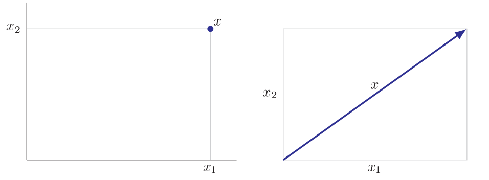
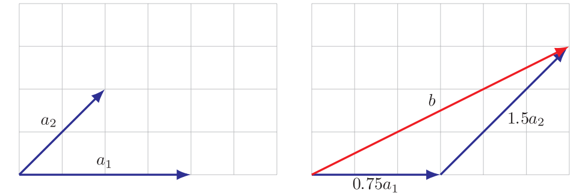
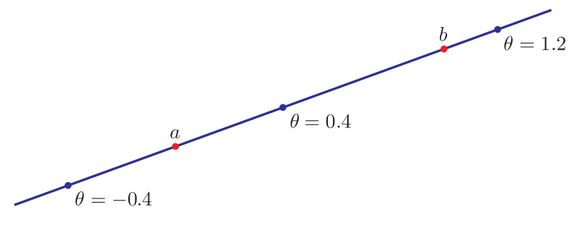
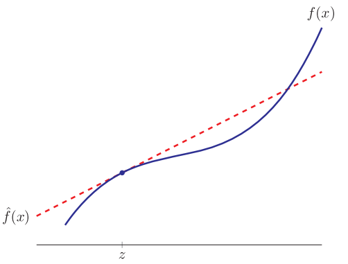

 # Lecture Notes of Linear Algebra []()

My study path towards Linear Algebra:

- Stephen Boyd, Lieven Vandenberghe, Introduction to Applied Linear Algebra
-  Strang, Linear Algebra online(MIT 18.06 Linear Algebra)

Since I am now resolved to incline to computational design rather than traditional architectural design, I feel compelled to review these knowledge. I am trying to revise the notes into digital format.


The following libraries are required among Jupyter Notebooks.

- [x] Matplotlib
- [x] NumPy
- [x] Python
- [x] SymPy


# 1.Vector

## 1.1 Definition

:pushpin: **vector**

It is a sequence of finite numbers / values. Normally it looks something like this:
$$
\begin{bmatrix}1\\2\\3\end{bmatrix}
\text{or}
\begin{pmatrix}1\\2\\3\end{pmatrix}
$$


:pushpin: **elements/entries/coefficients/components**

The above 4 names are the same. Naming, the individual element of a vector.


:pushpin:**size/dimension/length**

They are the same, naming how long is the vector.


:pushpin:**scalar and vector**

There are *real scalar*$\mathbb{R}$ and *complex scalar*$\mathbb{C}$. In most case, we refer *real scalar* as *scalar*.

Therefore, we also have *real vector* and *complex vector*. In most case, we refer *real vector* as vector.


:pushpin:**block or stacked vector**

Sometimes it is very convenient to *concatenate* or *stack* vectors.

e.g.
$$
a=\begin{bmatrix}a_1\\\vdots\\a_m\end{bmatrix},
b=\begin{bmatrix}b_1\\\vdots\\b_n\end{bmatrix},
c=\begin{bmatrix}c_1\\\vdots\\c_p\end{bmatrix},
\\\\
A=\begin{bmatrix}a_1\\\vdots\\a_m\\b_1\\\vdots\\b_n\\c_1\\\vdots\\c_p\end{bmatrix}
$$


```python
import numpy as np
a = np.array([[1],
              [2],
              [3]])
b = np.array([[4],
              [5],
              [6]])
c = np.array([[7],
              [8],
              [9]])
A = np.vstack([a,b,c])
```


:pushpin:**subvector/slice**

We call $a, b, c$ as the *subvector / slice*  of matrix $A$.


:pushpin: **colon notation and index range**

$a_{r:s}$ means slicing index $r$ to index $s$ elements in vector $a$. The size is $s-r+1$


:pushpin:**indexing**

when you see $a_i$ , there might be 2 different meaning.

- the $i$-th vector in the collection of vectors.
- the $i$-th element in the vector.

Therefore, for clarity. We use

- $a_i$ as the $i$-th vector.
- $(a_i)j$ as the $j$-th element of the $i$-th vector.


:pushpin: **zero vector**

$0_n$ represents a $n$-vector with all 0.


:pushpin: **unit vector**

One unit vector only has one nonzero element.
$$
e_1 = \begin{bmatrix}1\\0\\0\end{bmatrix},
e_2 = \begin{bmatrix}0\\1\\0\end{bmatrix},
e_3 = \begin{bmatrix}0\\0\\1\end{bmatrix}
$$


:pushpin: **Ones Vector**

Size of $n$-vector with all $1$ inside.


:pushpin: **Sparsity**

If there are many zero elements in one vector, then we can say this vector is sparse vector.

The number of nonzero elements in a vector $a$ can be denoted:
$$
nnz(a)
$$

### 1.1.2. Example

In machine learning or computer science, the vector is often saw as *a list of value* more than its mathematical meaning.

```c++
#include <vector>
//...
std:vector<int> ListInt;
```


:pushpin: **Displacement and Location**

A vector can either represents a *location* or a *displacement*.




:pushpin: **Colors**

The colors can be represented as vectors.


:pushpin: **Quantities**

A $n$-vector can represent amounts of different $n$ products.


:pushpin: **Value Across Population**

A $n$-vector can represent body temperature of different $n$ people.


:pushpin: **Image**

This is much more "machine learning" feel. If per pixel per vector
$$
\text{Pixel}_{i,j}=\begin{bmatrix}0.8\\0.2\\0.3\end{bmatrix}
$$
Then an $8\cross8$ pixels image can be flatten as:
$$
V = \begin{bmatrix}v_1,\cdots,v_n\end{bmatrix}\\
n = 8\cross8\cross3
$$

## 1.2. Vector Addition and Subtraction

Prerequisite: The vectors have to be same shape.
$$
\begin{bmatrix}0\\7\\3\end{bmatrix}+
\begin{bmatrix}1\\2\\0\end{bmatrix}=
\begin{bmatrix}1\\9\\3\end{bmatrix}
$$

### 1.2.1. Properties

:pushpin: **commutative**
$$
a+b = b+a
$$
:pushpin: **associative**

$$
(a+b)+c = a+(b+c)
$$

### 1.2.2. Example

:pushpin: **Displacement**


:pushpin: **Vector as a list of value**

There are lots of example of these.


## 1.3. Scalar-vector multiplication

Nothing special.
$$
(-2)\begin{bmatrix}0\\7\\3\end{bmatrix}=\begin{bmatrix}0\\-14\\-6\end{bmatrix}
$$

### 1.3.1. Property

$\alpha$-scalar

$\beta,\gamma$ -vector

:pushpin: **commutative**

$$
(\beta\gamma)\alpha = \beta(\gamma\alpha)
$$
:pushpin: **associative**
$$
(\beta+\gamma)\alpha = \beta\alpha+\gamma\alpha
$$

### 1.3.2. Example

:pushpin: **Displacement**

Scale the displacement.


### 1.3.3. Linear combination

scalar: $\beta_1,\cdots,\beta_n$

vector: $a_1,\cdots,a_n$

linear combination: $\beta_1\alpha_1+\cdots+\beta_n\alpha_n$, where $\beta_1,\cdots,\beta_n$ called *coefficients* of this linear combination


:pushpin: **Linear combination of unit vectors**

Nothing special, just a linear combination using *unit vectors* as bases.


:pushpin: **Special linear combinations**

*sum* , when $\beta_1=\cdots=\beta_n=1$

*mean* , when $\beta_1=\cdots=\beta_n=\frac{1}{n}$

*affine combination* , when $\beta_1+\cdots+\beta_n=1$

*convex combination / mixture / weighted average* , when *affine combination* $\geq 0$


### 1.3.4. Example

:pushpin: **Displacement**



:pushpin: **Line and Segment**

This is a good example of *affine combination*.

Use $c$ to represent a point on a line formed by $a,b$. Where $\theta$ is a scalar $0\leq\theta\leq1$
$$
c = (1-\theta)a+\theta b
$$



## 1.4. Inner Product(dot product)

:pushpin: **Equation**
$$
a^Tb = a_1b_1+a_2b_2+\cdots+a_nb_n
$$
There are other representation of *dot product*.
$$
\langle a,b\rangle  , \langle a|b\rangle  , (a,b),a\cdot b
$$

### 1.4.1. Properties

$$
\begin{align}
a^Tb &= b^Ta\\
(\gamma a)^Tb &= \gamma(a^Tb)\\
(a+b)^Tc &= a^Tc+b^Tc
\end{align}
$$


$$
(a+b)^T(c+d) = a^Tc+a^Td+b^Tc+b^Td
$$
in short, why the above would work? it is very easy to understand. 

- $(a+b)$ is a vector
- $(c+d)$ is also a vector
- $(a+b)$ has to transpose into $(a+b)^T$ , a.k.a. a row vector
- $(a+b)^T(c+d)$ , row vector * column vector is a *scalar*.  (if their dim are the same)


:pushpin: **$i$-th element**

$e_i$ , $i$-th unit vector

$a$, $n$-vector

$e_{i}^{T}a=a_i$ , this can filter out the $i$-th element of vector $a$. Why? Because except $i$-th column of $e_{i}^{T}$ is $1$, others are all $0$.


:pushpin: **sum**

$$
n\text{-dimension ones vector }\bold{1}\\
\bold{1}^Ta = a_1+\cdots+a_n
$$


:pushpin: **average / mean**

$$
(\bold{1}/n)^Ta = (a_1+\cdots+a_n)/n
$$


:pushpin: **sum of squares**

$$
a^Ta = a_1^2+\cdots+a_n^2
$$

### 1.4.2. Application

:pushpin: **co-occurrence**

$a, b$ are $n$-vectors that describe occurrence.  i.e. each of them is either 1 or 0.

Then the *total sum of co-occurrence* is:
$$
a=(0,1,1,1,1,1,1)\quad b= (1,0,1,0,1,0,0)\\
a^Tb = 2
$$
meaning, there are $2$ co-occurrence.


:pushpin: **weights / features / scores**

$f$ ,  $n$-vector for features, like ages, income, etc.

$w$, $n$-vector for the weights for every feature, like the weight of income maybe 1.3, etc.

$s$ , scalar, the sum of as the credit score for a person.
$$
s = w^Tf
$$


:pushpin: **document sentiment analysis**

$x, n$-vector, standing for $n$ words, each element records the appearance of the word in a book

$t, n$-vector are the corresponding type of the word. `-1=negative, 0=neutral, 1=positive` , e.g. "sad" is `-1`

Then the measure of the sentiment is:
$$
t^Tx
$$


## 1.5. Complexity of vector computation

:pushpin: **computer representation of numbers and vectors**

The real numbers $\mathbb{R}$ are stored in **floating point format**. It is either *64-bits* or *8-bytes*. Therefore, there are $2^{64}$ real numbers in a `x64` computer.


:pushpin: **floating point operation**

When computer carries out arithmetic operation, the result is rounded to the nearest floating point number. The very small error is called **round-off error**. Now you understand why you can't compare the *equality* of `float`.

Because the left hand side and right hand side are not equal sometimes!! But the error between is extremely small.


:pushpin: **flop counts and complexity**

> ​	**flop** = floating point operation per second

> ​	**complexity** ,  2 meanings
>
> > 	1. In theoretical computer science, the term `complexity` is to mean the number of flops of the best method to carry out the computation. It always is denoted as $O$.
> >  	2. In this book, it means the number of flops required by a specific method.


:pushpin: **complexity of vector operation**

- $n$ times
  - scalar-vector multiplication and division of $n$-vector , e.g. $aV$
  - vector addition and subtraction  $n$-vector, e.g. $P+V$
- $2n$ times
  - inner product of  $n$-vectors, e.g. $P^TV = P_1V_1+\cdots+P_nV_n$. Multiplication takes $n$ times, addition takes $n-1$ times. But for simplicity, we denote as $2n$ times.


:pushpin: **complexity of sparse vector operation**

> ​	$x,y$ are sparse vectors.

> ​	$ax$ takes $nnz(x)$ times.

> ​	$x+y$ takes 
>
> > 1. less than $\min\{\bold{nnz}(x),\bold{nnz}(y)\}$ times
> > 2. 0 times if $x$ and $y$ have zero overlapped.

> ​	$x^Ty$ takes
>
> > 1. less than $2\min\{\bold{nnz}(x),\bold{nnz}(y)\}$
> > 2. 0 times if they are not overlapped.


# 2.Linear Function

This chapter is mainly on Linear Function and Affine Function.

## 2.1. Basics of Linear Function

### 2.1.1. Function Notation

:pushpin:**The symbol**

Use $f$ to denote a function.


:pushpin: **What is a function?**

$f$ is a function that **maps** real $n$-vectors to **real** numbers. 

Therefore, $f(x)$ is a scalar which is the **value** of such function at $x$(param).  Hence, function sometimes is called real-valued function or scalar-valued function.


### 2.1.2. Inner Product Function

:pushpin: **What is it?**

An inner product function is like:
$$
f(x)=a^Tx = a_1x_1+a_2x_2+\cdots+a_nx_n
$$
$a$:   is a $n$-vector

$x$:   is also a $n$-vector

Since it is an inner product function, $f(x)$ therefore can be seen as a **weighted sum function** where $a$​ is the weight vector.


:pushpin: **Superposition叠加性 & Linearity线性性**

Suppose $f$ is an inner product function, $f$ can therefore be written as $a^T$. We have:
$$
\begin{align}
f(\alpha x+\beta y)&=a^T(\alpha x+ \beta y)\\
&=a^T(\alpha x)+a^T(\beta y)\\
&=\alpha(a^Tx)+\beta(a^Ty)\\
&=\alpha f(x)+\beta f(y)
\end{align}
$$
$x, y$ are $n$-vector.  $\alpha,\beta$​ are scalar. The property above is called **superposition**. A function is **linear** if it satisfies this property.


:pushpin: **Super Formal Definition on Linear**

The function $f: \mathbb{R}^n\to\mathbb{R}$  is linear which it MUST satisfy following 2 property:

- **homogeneity齐次性**.    $f(\alpha x)=\alpha f(x)$   emphasize on scaling
- **Additivity可加性.**    $f(x+y)=f(x)+f(y)$  emphasize on adding


:pushpin:**Inner Product Representation of a Linear Function**

The logic can be back and forth.

| Hypothesis/Conclusion                                        | Relation | Hypothesis/Conclusion |
| ------------------------------------------------------------ | -------- | --------------------- |
| A function defined as the inner product of its argument with some fixed vector. | :repeat: | A function is linear. |

We therefore say $a^Tx$ the inner product representation of $f$.


### 2.1.3. Example

:pushpin: **Average**

The average of a $n$-vector can be defined as:
$$
f(x)=(x_1+x_2+\cdots+x_n)/n
$$
It can be denoted as **avg($x$)** . It also can be written as:
$$
f(x)=a^Tx,\text{   st. }\\a=(\frac{1}{n},\frac{1}{n},\cdots,\frac{1}{n})^T=\bold{1}/n
$$
meaning times $1/n$​ for every elements.

 

:pushpin: **Maximum**

The maximum of a $n$-vector can be expressed as followed:
$$
f(x)=\text{max}\{x_1,\cdots,x_n\}
$$
Obviously, it is not a linear function. 


### 2.1.4. Affine Function

:pushpin: **What is it?**

Affine function is (linear function) + (a CONSTANT).
$$
f:\mathbb{R}^n\to\mathbb{R}
\\f(x)=a^Tx+b
$$
$a$:  a $n$-vector

$x$:  a $n$-vector

$b$:  a scalar, normally called **offset**


:pushpin: **Constraint on Superposition**

For linear function, no constraint on superposition.

For affine function, there IS constraint on superposition :warning:where the coefficients have to be **1** in total.

Because superposition is:
$$
f(\alpha x+\beta y)=\alpha f(x)+\beta f(y)
$$
And affine function is:
$$
f(x)=a^Tx+b
$$
Therefore there are **2** in both sides:
$$
b=\alpha b_1+\beta b_2
$$
So the only chance they are the same is that 
$$
\alpha+\beta=1
$$
:thinking: What can we take advantage of this property?

OK, an affine function can satisfy superposition if and only if $\alpha+\beta=1$. Therefore, we can think another way around: if we set $\alpha+\beta=1$, and the function does NOT satisfy superposition, then it is NOT an affine function.


## 2.2. Taylor Approximation

:pushpin: **What for?**

:dart: Application on scalar-valued functions of $n$ variables, or **relations** between $n$ variables and a scalar.
$$
\begin{bmatrix}
x_1\\x_2\\\vdots\\x_n 
\end{bmatrix}
\to a
$$
Normally, this relation is **approximated** by either :one: linear function or :two: affine function. Sometime these 2 functions are called **model**.


:pushpin: **What is Taylor Approximation?**

Suppose that $f: \mathbb{R^n} \to \mathbb{R}$ is differentiable, which means that its partial derivatives exist. Let $z$ be an $n$-vector. The (first-order) *Taylor Approximation* of $f$ near (or at) the point $z$ is the function $\hat{f}(x)$ of $x$ defined as:
$$
\hat{f}(x)=f(z)+\frac{\partial f}{\partial x_1}(z)(x_1-z_1)+\cdots+\frac{\partial f}{\partial x_n}(z)(x_n-z_n)
$$

- $\frac{\partial f}{\partial x_i}(z)$ , denotes the partial derivative of $f$ with respect to its $i$th argument, evaluated at the $n$-vector $z$.

- $\hat{f}$  ,  the hat is a hint that it is an approximation of the function $f$.
- $\hat{f}(x;z)$  , is written with 2nd argument to show the point  $z$ at which the approximation is developed.
- $f(z)$  , the first item of Taylor is **constant**, while others can be seen as the contributions to the change(from $f(z)$) due to the changes in the component of $x$ (from $z$).


:pushpin:**Affine Function**

Apparently, since there is always a $f(z)$ ,which is a constant, in the beginning, $\hat{f}(x)$ is therefore an **affine function**. It could be written as followed:
$$
\hat{f}(x)=f(z)+\grad f(z)^T(x-z)
$$
- $f(z)$, it is a constant which is the value of this function when $x=z$

- $\grad f(z)$  , is a $n$-vector, the **gradient** of $f$ at the point $z$ is:

$$
\grad f(z)=\begin{bmatrix}\frac{\partial f}{\partial x_1}(z)\\\vdots\\\frac{\partial f}{\partial x_n}(z)\end{bmatrix}
$$

- $(x-z)$, the **deviation/perturbation(偏差/扰动)** of $x$ respect to $z$


:pushpin: **What does it mean by `approximation`?**

A simple example, for $n = 1$, is shown in the following figure. Over the full $x$-axis scale shown, the Taylor approximation $\hat{f}$ does not give a good approximation of the function $f$. But for **$x$ near $z$**, the Taylor approximation is very **good**.



A function f of one variable, and the first-order Taylor approximation $\hat{f}(x)=f(z)+f'(z)(x-z)$


:pushpin: **Example**

Consider the function $f : \mathbb{R}^2 \to \mathbb{R}$ given by $f(x) = x_1 + \text{exp}(x_2 − x_1 )$ , which is not linear or affine. The assignment is to **find** the Taylor Approximation $\hat{f}$ **near the point** $z=(1,2)$.

- first, take the partial derivative of this function:

$$
\grad f(z)=
\begin{bmatrix}
1-\text{exp}(z_2-z_1)\\
\text{exp}(z_2-z_1)
\end{bmatrix}
$$

- two, place $z_2=2, z_1=1$ in it
- $\text{exp}=e,\quad e^1=2.7183$, therefore $\grad f(z)$ at $z=(1,2)$ is:

$$
\grad f(z)=
\begin{bmatrix}
1-e^1\\
e^1
\end{bmatrix}
=
\begin{bmatrix}
-1.7183\\
2.7183
\end{bmatrix}
$$

- $f(z)$ at $z=(1,2)$ is:

$$
f(z)=x_1 + \text{exp}(x_2 − x_1 )=1+e^{2-1}=3.7183
$$

- the Taylor approximation therefore is:

$$
\begin{align}
\hat{f}(x)&=f(z)+\grad f(z)^T(x-z)\\
&=3.7183+\begin{bmatrix}-1.7183&
2.7183\end{bmatrix}^T(x-\begin{bmatrix}1\\2\end{bmatrix})\\
&=3.7183+\begin{bmatrix}-1.7183&
2.7183\end{bmatrix}^T(\begin{bmatrix}x_1\\x_2\end{bmatrix}-\begin{bmatrix}1\\2\end{bmatrix})\\
&=3.7183-1.7183(x_1 -1)+2.7183(x_2-2)
\end{align}
$$

How to measure it is a good approximation:

| $x$           | $f(x)$ | $\hat{f}(x)$ | $\abs{\hat{f}(x)-f(x)}$ |
| ------------- | ------ | ------------ | ----------------------- |
| (1.00, 2.00)  | 3.7183 | 3.7183       | 0.000                   |
| (0.96, 1.98)  | 3.7332 | 3.7326       | 0.0005                  |
| (1 .10, 2.11) | 3.8456 | 3.8455       | 0.0001                  |
| (0.85, 2.05)  | 4.1701 | 4.1119       | 0.0582                  |
| (1.25, 2.41)  | 4.4399 | 4.4032       | 0.0367                  |


## 2.3. Regression Model

:pushpin: **What is it?**
$$
\hat{y} = x^T\beta+v
$$

- $x$, a $n$-vector a.k.a. **feature** vector
  - $x_1,x_2,...,x_n$ are regressor
- $\beta$, a $n$-vector, **weight vector** / coefficient vector
- $v$, a scalar, **offset** / intercept
- $\hat{y}$, the $\hat{}$ symbol indicating it is an estimate / **prediction**
- $y$, dependent variable, **output labels**

Special Indication:

- $\beta, v$ are both parameters tuning this regression model.
- $\beta$ is a weight vector which indicates the dependence between input and the performance of model.
  - e.g. $\beta_{13}$ is bigger, $x_{13}$ has more significant effect on the model
  - e.g. $\beta_{27}$ is smaller, $x_{27}$ has less effect on the model


:pushpin: **Simplified Regression Model Notation**

Although I think this notation is kind of useless, the following is its equation.
$$
\hat{y}=x^T\beta+v=\begin{bmatrix}1\\x\end{bmatrix}^T\begin{bmatrix}v\\\beta\end{bmatrix}
$$
The dimension of $1,v$ are 1.

The dimension of $x,\beta$ are $n$.

Literally no difference from the left hand side.


:pushpin: **House price regression model**

Suppose:

- $y$, the actual selling price of the house
- $x_1$, the house area
- $x_2$, the number of bedrooms
- $\hat{y}$, the estimate price

Then we have:
$$
\hat{y}=x^T\beta+v=\beta_1x_1+\beta_2x_2+v
$$
As a specific numerical example, consider the regression model parameters:
$$
\beta=(148.73,-18.85), \quad v=54.40
$$

- $\beta_1>0$, it is easy to understand, house area:arrow_up_small:, price:arrow_up_small:
- $\beta_2<0$, this is hard to understand, maybe because increasing the number of rooms with same area will be considered as a public house?..(公租房)
- $v>0$, considering when $x_1=0,x_2=0$, then $v=54.40$, that is the value of the lot.(土地价格)


# 3.Norm and Distance

## 3.1. Norm

:pushpin: **Euclidean Norm(L-2 Norm)**

Suppose:

- $x$ is a $n$-vector
- $\norm{x}$, is denoted as its *norm*.

$$
\norm{x}=\sqrt{x_1^2+x_2^2+\cdots+x_n^2+}
$$

Since it is no difference as the **squareroot of the inner product** of the vector with **itself**, we can write as:
$$
\norm{x}=\sqrt{x^Tx}
$$
Another notation of Euclidean Norm:
$$
\norm{x}_2
$$
The subscript $2$ indicates that the entries of $x$ are raised to the second power. That's why we call it L-2 Norm.


:pushpin: **Why we use $\norm{ }$ to wrap Euclidean Norm?**

> ​	:star:For measuring magnitude

The double bar notation indicates the norm of a vector is a (numerical) measure of its **magnitude**(not considering orientation). Therefore, we can say a vector is **small** if its *norm is a small* number, and **large** is with a *large number*.


:pushpin: **Properties of Norm**

//TODO


:pushpin: ****


:pushpin: ****


:pushpin: ****


:pushpin: ****


:pushpin: ****


:pushpin: ****


:pushpin: ****


:pushpin: ****


:pushpin: ****


:pushpin: ****


:pushpin: ****


:pushpin: ****


:pushpin: ****


:pushpin: ****


:pushpin: ****


:pushpin: ****


:pushpin: ****


:pushpin: ****


:pushpin: ****


:pushpin: ****


:pushpin: ****


:pushpin: ****


:pushpin: ****


:pushpin: ****


:pushpin: ****


:pushpin: ****


:pushpin: ****


:pushpin: ****


:pushpin: ****


:pushpin: ****


:pushpin: ****


:pushpin: ****


:pushpin: ****


:pushpin: ****


:pushpin: ****


:pushpin: ****


:pushpin: ****


:pushpin: ****


:pushpin: ****


:pushpin: ****


:pushpin: ****


:pushpin: ****


:pushpin: ****


:pushpin: ****


:pushpin: ****


:pushpin: ****


:pushpin: ****


:pushpin: ****


:pushpin: ****


:pushpin: ****


:pushpin: ****


:pushpin: ****


:pushpin: ****


:pushpin: ****


:pushpin: ****


:pushpin: ****


:pushpin: ****


:pushpin: ****


:pushpin: ****


:pushpin: ****


:pushpin: ****


:pushpin: ****


:pushpin: ****


:pushpin: ****


:pushpin: ****


:pushpin: ****


:pushpin: ****


:pushpin: ****


:pushpin: ****


:pushpin: ****


:pushpin: ****


:pushpin: ****


:pushpin: ****


:pushpin: ****


:pushpin: ****


:pushpin: ****


:pushpin: ****


:pushpin: ****


:pushpin: ****


:pushpin: ****


:pushpin: ****


:pushpin: ****


:pushpin: ****


:pushpin: ****


:pushpin: ****


:pushpin: ****


:pushpin: ****


:pushpin: ****


:pushpin: ****


:pushpin: ****


:pushpin: ****


:pushpin: ****


:pushpin: ****


:pushpin: ****


:pushpin: ****


:pushpin: ****


:pushpin: ****


:pushpin: ****


:pushpin: ****


:pushpin: ****


:pushpin: ****


:pushpin: ****


:pushpin: ****


:pushpin: ****


:pushpin: ****


:pushpin: ****


:pushpin: ****


:pushpin: ****


:pushpin: ****


:pushpin: ****


:pushpin: ****


:pushpin: ****


:pushpin: ****


:pushpin: ****


:pushpin: ****


:pushpin: ****


:pushpin: ****


:pushpin: ****


:pushpin: ****


:pushpin: ****


:pushpin: ****


:pushpin: ****


:pushpin: ****


:pushpin: ****


:pushpin: ****


:pushpin: ****


:pushpin: ****


:pushpin: ****


:pushpin: ****


:pushpin: ****


:pushpin: ****


:pushpin: ****


:pushpin: ****


:pushpin: ****


:pushpin: ****


:pushpin: ****


:pushpin: ****


:pushpin: ****


:pushpin: ****


:pushpin: ****


:pushpin: ****


:pushpin: ****


:pushpin: ****


:pushpin: ****


:pushpin: ****


:pushpin: ****


:pushpin: ****


:pushpin: ****


:pushpin: ****


:pushpin: ****


:pushpin: ****


:pushpin: ****


:pushpin: ****


:pushpin: ****


:pushpin: ****


:pushpin: ****


:pushpin: ****


:pushpin: ****


:pushpin: ****


:pushpin: ****


:pushpin: ****


:pushpin: ****


:pushpin: ****


:pushpin: ****


:pushpin: ****


:pushpin: ****


:pushpin: ****


:pushpin: ****


:pushpin: ****


:pushpin: ****


:pushpin: ****


:pushpin: ****


:pushpin: ****


:pushpin: ****


:pushpin: ****


:pushpin: ****


:pushpin: ****


:pushpin: ****


:pushpin: ****


:pushpin: ****


:pushpin: ****


:pushpin: ****


:pushpin: ****


:pushpin: ****


:pushpin: ****


:pushpin: ****


:pushpin: ****


:pushpin: ****


:pushpin: ****


:pushpin: ****


:pushpin: ****


:pushpin: ****


:pushpin: ****


:pushpin: ****


:pushpin: ****


:pushpin: ****


:pushpin: ****


:pushpin: ****


:pushpin: ****


:pushpin: ****


:pushpin: ****


:pushpin: ****


:pushpin: ****


:pushpin: ****


:pushpin: ****


:pushpin: ****


:pushpin: ****


:pushpin: ****


:pushpin: ****


:pushpin: ****


:pushpin: ****


:pushpin: ****


:pushpin: ****


:pushpin: ****


:pushpin: ****


:pushpin: ****


:pushpin: ****


:pushpin: ****


:pushpin: ****


:pushpin: ****


:pushpin: ****


:pushpin: ****


:pushpin: ****


:pushpin: ****


:pushpin: ****


:pushpin: ****


:pushpin: ****


:pushpin: ****


:pushpin: ****


:pushpin: ****


:pushpin: ****


:pushpin: ****


:pushpin: ****


:pushpin: ****


:pushpin: ****


:pushpin: ****


:pushpin: ****


:pushpin: ****


:pushpin: ****


:pushpin: ****


:pushpin: ****


:pushpin: ****


:pushpin: ****


:pushpin: ****


:pushpin: ****


:pushpin: ****


:pushpin: ****


:pushpin: ****


:pushpin: ****


:pushpin: ****


:pushpin: ****


:pushpin: ****


:pushpin: ****


:pushpin: ****


:pushpin: ****


:pushpin: ****


:pushpin: ****


:pushpin: ****


:pushpin: ****


:pushpin: ****


:pushpin: ****


:pushpin: ****


:pushpin: ****


:pushpin: ****


:pushpin: ****


:pushpin: ****


:pushpin: ****


:pushpin: ****


:pushpin: ****


:pushpin: ****


:pushpin: ****


:pushpin: ****


:pushpin: ****


:pushpin: ****


:pushpin: ****


:pushpin: ****


:pushpin: ****


:pushpin: ****


:pushpin: ****


:pushpin: ****


:pushpin: ****


:pushpin: ****


:pushpin: ****


:pushpin: ****


:pushpin: ****


:pushpin: ****


:pushpin: ****


:pushpin: ****


:pushpin: ****


:pushpin: ****


:pushpin: ****


:pushpin: ****


:pushpin: ****


:pushpin: ****


:pushpin: ****


:pushpin: ****


:pushpin: ****


:pushpin: ****


:pushpin: ****


:pushpin: ****


:pushpin: ****


:pushpin: ****


:pushpin: ****


:pushpin: ****


:pushpin: ****


:pushpin: ****


:pushpin: ****


:pushpin: ****


:pushpin: ****


:pushpin: ****


:pushpin: ****


:pushpin: ****


:pushpin: ****


:pushpin: ****


:pushpin: ****


:pushpin: ****


:pushpin: ****


:pushpin: ****


:pushpin: ****


:pushpin: ****


:pushpin: ****


:pushpin: ****


:pushpin: ****


:pushpin: ****


:pushpin: ****


:pushpin: ****


:pushpin: ****


:pushpin: ****


:pushpin: ****


:pushpin: ****


:pushpin: ****


:pushpin: ****


:pushpin: ****


:pushpin: ****


:pushpin: ****


:pushpin: ****


:pushpin: ****


:pushpin: ****


:pushpin: ****


:pushpin: ****


:pushpin: ****


:pushpin: ****


:pushpin: ****


:pushpin: ****


:pushpin: ****


:pushpin: ****


:pushpin: ****


:pushpin: ****


:pushpin: ****


:pushpin: ****


:pushpin: ****


:pushpin: ****


:pushpin: ****


:pushpin: ****


:pushpin: ****


:pushpin: ****


:pushpin: ****


:pushpin: ****


:pushpin: ****


:pushpin: ****


:pushpin: ****


:pushpin: ****


:pushpin: ****


:pushpin: ****


:pushpin: ****


:pushpin: ****


:pushpin: ****


:pushpin: ****


:pushpin: ****


:pushpin: ****


:pushpin: ****


:pushpin: ****


:pushpin: ****


:pushpin: ****


:pushpin: ****


:pushpin: ****


:pushpin: ****


:pushpin: ****


:pushpin: ****


:pushpin: ****


:pushpin: ****


:pushpin: ****


:pushpin: ****


:pushpin: ****


:pushpin: ****


:pushpin: ****


:pushpin: ****


:pushpin: ****


:pushpin: ****


:pushpin: ****


:pushpin: ****


:pushpin: ****


:pushpin: ****


:pushpin: ****


:pushpin: ****


:pushpin: ****


:pushpin: ****


:pushpin: ****


:pushpin: ****


:pushpin: ****


:pushpin: ****


:pushpin: ****


:pushpin: ****


:pushpin: ****


:pushpin: ****


:pushpin: ****


:pushpin: ****


:pushpin: ****


:pushpin: ****


:pushpin: ****


:pushpin: ****


:pushpin: ****


:pushpin: ****


:pushpin: ****


:pushpin: ****


:pushpin: ****


:pushpin: ****


:pushpin: ****


:pushpin: ****


:pushpin: ****


:pushpin: ****


:pushpin: ****


:pushpin: ****


:pushpin: ****


:pushpin: ****


:pushpin: ****


:pushpin: ****


:pushpin: ****


:pushpin: ****


:pushpin: ****


:pushpin: ****


:pushpin: ****


:pushpin: ****


:pushpin: ****


:pushpin: ****


:pushpin: ****


:pushpin: ****


:pushpin: ****


:pushpin: ****


:pushpin: ****


:pushpin: ****


:pushpin: ****


:pushpin: ****


:pushpin: ****


:pushpin: ****


:pushpin: ****


:pushpin: ****


:pushpin: ****


:pushpin: ****


:pushpin: ****


:pushpin: ****


:pushpin: ****


:pushpin: ****


:pushpin: ****


:pushpin: ****


:pushpin: ****


:pushpin: ****


:pushpin: ****


:pushpin: ****


:pushpin: ****


:pushpin: ****


:pushpin: ****


:pushpin: ****


:pushpin: ****


:pushpin: ****


:pushpin: ****


:pushpin: ****


:pushpin: ****


:pushpin: ****


:pushpin: ****


:pushpin: ****


:pushpin: ****


:pushpin: ****


:pushpin: ****


:pushpin: ****


:pushpin: ****


:pushpin: ****


:pushpin: ****


:pushpin: ****


:pushpin: ****


:pushpin: ****


:pushpin: ****


:pushpin: ****


:pushpin: ****


:pushpin: ****


:pushpin: ****


:pushpin: ****


:pushpin: ****


:pushpin: ****


:pushpin: ****


:pushpin: ****


:pushpin: ****


:pushpin: ****


:pushpin: ****


:pushpin: ****


:pushpin: ****


:pushpin: ****


:pushpin: ****


:pushpin: ****


:pushpin: ****


:pushpin: ****


:pushpin: ****


:pushpin: ****


:pushpin: ****


:pushpin: ****


:pushpin: ****


:pushpin: ****


:pushpin: ****


:pushpin: ****


:pushpin: ****


:pushpin: ****


:pushpin: ****


:pushpin: ****


:pushpin: ****


:pushpin: ****


:pushpin: ****


:pushpin: ****


:pushpin: ****


:pushpin: ****


:pushpin: ****


:pushpin: ****


:pushpin: ****


:pushpin: ****


:pushpin: ****


:pushpin: ****


:pushpin: ****


:pushpin: ****


:pushpin: ****


:pushpin: ****


:pushpin: ****


:pushpin: ****


:pushpin: ****


:pushpin: ****


:pushpin: ****


:pushpin: ****


:pushpin: ****


:pushpin: ****


:pushpin: ****


:pushpin: ****


:pushpin: ****


:pushpin: ****


:pushpin: ****


:pushpin: ****


:pushpin: ****


:pushpin: ****


:pushpin: ****


:pushpin: ****


:pushpin: ****


:pushpin: ****


:pushpin: ****


:pushpin: ****


:pushpin: ****


:pushpin: ****


:pushpin: ****


:pushpin: ****


:pushpin: ****


:pushpin: ****


:pushpin: ****


:pushpin: ****


:pushpin: ****


:pushpin: ****


:pushpin: ****


:pushpin: ****


:pushpin: ****


:pushpin: ****


:pushpin: ****


:pushpin: ****


:pushpin: ****


:pushpin: ****


:pushpin: ****


:pushpin: ****


:pushpin: ****


:pushpin: ****


:pushpin: ****


:pushpin: ****


:pushpin: ****


:pushpin: ****


:pushpin: ****


:pushpin: ****


:pushpin: ****


:pushpin: ****


:pushpin: ****


:pushpin: ****


:pushpin: ****


:pushpin: ****


:pushpin: ****


:pushpin: ****


:pushpin: ****


:pushpin: ****


:pushpin: ****


:pushpin: ****


:pushpin: ****


:pushpin: ****


:pushpin: ****


:pushpin: ****


:pushpin: ****


:pushpin: ****


:pushpin: ****


:pushpin: ****


:pushpin: ****


:pushpin: ****


:pushpin: ****


:pushpin: ****


:pushpin: ****


:pushpin: ****


:pushpin: ****


:pushpin: ****


:pushpin: ****


:pushpin: ****


:pushpin: ****


:pushpin: ****


:pushpin: ****


:pushpin: ****


:pushpin: ****


:pushpin: ****


:pushpin: ****


:pushpin: ****


:pushpin: ****


:pushpin: ****


:pushpin: ****


:pushpin: ****


:pushpin: ****


:pushpin: ****


:pushpin: ****


:pushpin: ****


:pushpin: ****


:pushpin: ****


:pushpin: ****


:pushpin: ****


:pushpin: ****


:pushpin: ****


:pushpin: ****


:pushpin: ****


:pushpin: ****


:pushpin: ****


:pushpin: ****


:pushpin: ****


:pushpin: ****


:pushpin: ****


:pushpin: ****


:pushpin: ****


:pushpin: ****


:pushpin: ****


:pushpin: ****


:pushpin: ****


:pushpin: ****


:pushpin: ****


:pushpin: ****


:pushpin: ****


:pushpin: ****


:pushpin: ****


:pushpin: ****


:pushpin: ****


:pushpin: ****


:pushpin: ****


:pushpin: ****


:pushpin: ****


:pushpin: ****


:pushpin: ****


:pushpin: ****


:pushpin: ****


:pushpin: ****


:pushpin: ****


:pushpin: ****


:pushpin: ****


:pushpin: ****


:pushpin: ****


:pushpin: ****


:pushpin: ****


:pushpin: ****


:pushpin: ****


:pushpin: ****


:pushpin: ****


:pushpin: ****


:pushpin: ****


:pushpin: ****


:pushpin: ****


:pushpin: ****


:pushpin: ****


:pushpin: ****


:pushpin: ****


:pushpin: ****


:pushpin: ****


:pushpin: ****


:pushpin: ****


:pushpin: ****


:pushpin: ****


:pushpin: ****


:pushpin: ****


:pushpin: ****


:pushpin: ****


:pushpin: ****


:pushpin: ****


:pushpin: ****


:pushpin: ****


:pushpin: ****


:pushpin: ****


:pushpin: ****


:pushpin: ****


:pushpin: ****


:pushpin: ****


:pushpin: ****


:pushpin: ****


:pushpin: ****


:pushpin: ****


:pushpin: ****


:pushpin: ****


:pushpin: ****


:pushpin: ****


:pushpin: ****


:pushpin: ****


:pushpin: ****


:pushpin: ****


:pushpin: ****


:pushpin: ****


:pushpin: ****


:pushpin: ****


:pushpin: ****


:pushpin: ****


:pushpin: ****


:pushpin: ****


:pushpin: ****


:pushpin: ****


:pushpin: ****


:pushpin: ****


:pushpin: ****


:pushpin: ****


:pushpin: ****


:pushpin: ****


:pushpin: ****


:pushpin: ****


:pushpin: ****


:pushpin: ****


:pushpin: ****


:pushpin: ****


:pushpin: ****


:pushpin: ****


:pushpin: ****


:pushpin: ****


:pushpin: ****


:pushpin: ****


:pushpin: ****


:pushpin: ****


:pushpin: ****


:pushpin: ****


:pushpin: ****


:pushpin: ****


:pushpin: ****


:pushpin: ****


:pushpin: ****


:pushpin: ****


:pushpin: ****


:pushpin: ****


:pushpin: ****


:pushpin: ****


:pushpin: ****


:pushpin: ****


:pushpin: ****


:pushpin: ****


:pushpin: ****


:pushpin: ****


:pushpin: ****


:pushpin: ****


:pushpin: ****


:pushpin: ****


:pushpin: ****


:pushpin: ****


:pushpin: ****


:pushpin: ****


:pushpin: ****


:pushpin: ****


:pushpin: ****


:pushpin: ****


:pushpin: ****


:pushpin: ****


:pushpin: ****


:pushpin: ****


:pushpin: ****


:pushpin: ****


:pushpin: ****


:pushpin: ****


:pushpin: ****


:pushpin: ****


:pushpin: ****


:pushpin: ****


:pushpin: ****


:pushpin: ****


:pushpin: ****


:pushpin: ****


:pushpin: ****


:pushpin: ****


:pushpin: ****


:pushpin: ****


:pushpin: ****


:pushpin: ****


:pushpin: ****


:pushpin: ****


:pushpin: ****


:pushpin: ****


:pushpin: ****


:pushpin: ****


:pushpin: ****


:pushpin: ****


:pushpin: ****


:pushpin: ****


:pushpin: ****


:pushpin: ****


:pushpin: ****


:pushpin: ****


:pushpin: ****


:pushpin: ****


:pushpin: ****


:pushpin: ****


:pushpin: ****


:pushpin: ****


:pushpin: ****


:pushpin: ****


:pushpin: ****


:pushpin: ****


:pushpin: ****


:pushpin: ****


:pushpin: ****


:pushpin: ****


:pushpin: ****


:pushpin: ****


:pushpin: ****


:pushpin: ****


:pushpin: ****


:pushpin: ****


:pushpin: ****


:pushpin: ****


:pushpin: ****


:pushpin: ****


:pushpin: ****


:pushpin: ****


:pushpin: ****


:pushpin: ****


:pushpin: ****


:pushpin: ****


:pushpin: ****


:pushpin: ****


:pushpin: ****


:pushpin: ****


:pushpin: ****


:pushpin: ****


:pushpin: ****


:pushpin: ****


:pushpin: ****


:pushpin: ****


:pushpin: ****


:pushpin: ****


:pushpin: ****


:pushpin: ****


:pushpin: ****


:pushpin: ****


:pushpin: ****


:pushpin: ****


:pushpin: ****


:pushpin: ****


:pushpin: ****


:pushpin: ****


:pushpin: ****


:pushpin: ****


:pushpin: ****


:pushpin: ****


:pushpin: ****


:pushpin: ****


:pushpin: ****


:pushpin: ****


:pushpin: ****


:pushpin: ****


:pushpin: ****


:pushpin: ****


:pushpin: ****


:pushpin: ****


:pushpin: ****


:pushpin: ****


:pushpin: ****


:pushpin: ****


:pushpin: ****


:pushpin: ****


:pushpin: ****


:pushpin: ****


:pushpin: ****


:pushpin: ****


:pushpin: ****


:pushpin: ****


:pushpin: ****


:pushpin: ****


:pushpin: ****


:pushpin: ****


:pushpin: ****


:pushpin: ****


:pushpin: ****


:pushpin: ****


:pushpin: ****


:pushpin: ****


:pushpin: ****


:pushpin: ****


:pushpin: ****


:pushpin: ****


:pushpin: ****


:pushpin: ****


:pushpin: ****


:pushpin: ****


:pushpin: ****


:pushpin: ****


:pushpin: ****


:pushpin: ****


:pushpin: ****


:pushpin: ****


:pushpin: ****


:pushpin: ****


:pushpin: ****


:pushpin: ****


:pushpin: ****


:pushpin: ****


:pushpin: ****


:pushpin: ****


:pushpin: ****


:pushpin: ****


:pushpin: ****


:pushpin: ****


:pushpin: ****


:pushpin: ****


:pushpin: ****


:pushpin: ****


:pushpin: ****


:pushpin: ****


:pushpin: ****


:pushpin: ****


:pushpin: ****


:pushpin: ****


:pushpin: ****


:pushpin: ****


:pushpin: ****


:pushpin: ****


:pushpin: ****


:pushpin: ****


:pushpin: ****


:pushpin: ****


:pushpin: ****


:pushpin: ****


:pushpin: ****


:pushpin: ****


:pushpin: ****


:pushpin: ****


:pushpin: ****


:pushpin: ****


:pushpin: ****


:pushpin: ****


:pushpin: ****


:pushpin: ****


:pushpin: ****


:pushpin: ****


:pushpin: ****


:pushpin: ****


:pushpin: ****


:pushpin: ****


:pushpin: ****


:pushpin: ****


:pushpin: ****


:pushpin: ****


:pushpin: ****


:pushpin: ****


:pushpin: ****


:pushpin: ****


:pushpin: ****


:pushpin: ****


:pushpin: ****


:pushpin: ****


:pushpin: ****


:pushpin: ****


:pushpin: ****


:pushpin: ****


:pushpin: ****


:pushpin: ****


:pushpin: ****


:pushpin: ****


:pushpin: ****


:pushpin: ****


:pushpin: ****


:pushpin: ****


:pushpin: ****


:pushpin: ****


:pushpin: ****


:pushpin: ****


:pushpin: ****


:pushpin: ****


:pushpin: ****


:pushpin: ****


:pushpin: ****


:pushpin: ****


:pushpin: ****


:pushpin: ****


:pushpin: ****


:pushpin: ****


:pushpin: ****


:pushpin: ****


:pushpin: ****


:pushpin: ****


:pushpin: ****


:pushpin: ****


:pushpin: ****


:pushpin: ****


:pushpin: ****


:pushpin: ****


:pushpin: ****


:pushpin: ****


:pushpin: ****


:pushpin: ****


:pushpin: ****


:pushpin: ****


:pushpin: ****


:pushpin: ****


:pushpin: ****


:pushpin: ****


:pushpin: ****


:pushpin: ****


:pushpin: ****


:pushpin: ****


:pushpin: ****


:pushpin: ****


:pushpin: ****


:pushpin: ****


:pushpin: ****


:pushpin: ****


:pushpin: ****


:pushpin: ****


:pushpin: ****


:pushpin: ****


:pushpin: ****


:pushpin: ****


:pushpin: ****


:pushpin: ****


:pushpin: ****


:pushpin: ****


:pushpin: ****


:pushpin: ****


:pushpin: ****


:pushpin: ****


:pushpin: ****


:pushpin: ****


:pushpin: ****


:pushpin: ****


:pushpin: ****


:pushpin: ****


:pushpin: ****


:pushpin: ****


:pushpin: ****


:pushpin: ****


:pushpin: ****


:pushpin: ****


:pushpin: ****


:pushpin: ****


:pushpin: ****


:pushpin: ****


:pushpin: ****


:pushpin: ****


:pushpin: ****


:pushpin: ****


:pushpin: ****


:pushpin: ****


:pushpin: ****


:pushpin: ****


:pushpin: ****


:pushpin: ****


:pushpin: ****


:pushpin: ****


:pushpin: ****


:pushpin: ****


:pushpin: ****


:pushpin: ****


:pushpin: ****


:pushpin: ****


:pushpin: ****


:pushpin: ****


:pushpin: ****


:pushpin: ****


:pushpin: ****


:pushpin: ****


:pushpin: ****


:pushpin: ****


:pushpin: ****


:pushpin: ****


:pushpin: ****


:pushpin: ****


:pushpin: ****


:pushpin: ****


:pushpin: ****


:pushpin: ****


:pushpin: ****


:pushpin: ****


:pushpin: ****


:pushpin: ****


:pushpin: ****


:pushpin: ****


:pushpin: ****


:pushpin: ****


:pushpin: ****


:pushpin: ****


:pushpin: ****


:pushpin: ****


:pushpin: ****


:pushpin: ****


:pushpin: ****


:pushpin: ****


:pushpin: ****


:pushpin: ****


:pushpin: ****


:pushpin: ****


:pushpin: ****


:pushpin: ****


:pushpin: ****


:pushpin: ****


:pushpin: ****


:pushpin: ****


:pushpin: ****


:pushpin: ****


:pushpin: ****


:pushpin: ****


:pushpin: ****


:pushpin: ****


:pushpin: ****


:pushpin: ****


:pushpin: ****


:pushpin: ****


:pushpin: ****


:pushpin: ****


:pushpin: ****


:pushpin: ****


:pushpin: ****


:pushpin: ****


:pushpin: ****


:pushpin: ****


:pushpin: ****


:pushpin: ****


:pushpin: ****


:pushpin: ****


:pushpin: ****


:pushpin: ****


:pushpin: ****


:pushpin: ****


:pushpin: ****


:pushpin: ****


:pushpin: ****


:pushpin: ****


:pushpin: ****


:pushpin: ****


:pushpin: ****


:pushpin: ****


:pushpin: ****


:pushpin: ****


:pushpin: ****


:pushpin: ****


:pushpin: ****


:pushpin: ****


:pushpin: ****


:pushpin: ****


:pushpin: ****


:pushpin: ****


:pushpin: ****


:pushpin: ****


:pushpin: ****


:pushpin: ****


:pushpin: ****


:pushpin: ****


:pushpin: ****


:pushpin: ****


:pushpin: ****


:pushpin: ****


:pushpin: ****


:pushpin: ****


:pushpin: ****


:pushpin: ****


:pushpin: ****


:pushpin: ****


:pushpin: ****


:pushpin: ****


:pushpin: ****


:pushpin: ****


:pushpin: ****


:pushpin: ****


:pushpin: ****


:pushpin: ****


:pushpin: ****


:pushpin: ****


:pushpin: ****


:pushpin: ****


:pushpin: ****


:pushpin: ****


:pushpin: ****


:pushpin: ****


:pushpin: ****


:pushpin: ****


:pushpin: ****


:pushpin: ****


:pushpin: ****


:pushpin: ****


:pushpin: ****


:pushpin: ****


:pushpin: ****


:pushpin: ****


:pushpin: ****


:pushpin: ****


:pushpin: ****


:pushpin: ****


:pushpin: ****


:pushpin: ****


:pushpin: ****


:pushpin: ****


:pushpin: ****


:pushpin: ****


:pushpin: ****


:pushpin: ****


:pushpin: ****


:pushpin: ****


:pushpin: ****


:pushpin: ****


:pushpin: ****


:pushpin: ****


:pushpin: ****


:pushpin: ****


:pushpin: ****


:pushpin: ****


:pushpin: ****


:pushpin: ****


:pushpin: ****


:pushpin: ****


:pushpin: ****


:pushpin: ****


:pushpin: ****


:pushpin: ****


:pushpin: ****


:pushpin: ****


:pushpin: ****


:pushpin: ****


:pushpin: ****


:pushpin: ****


:pushpin: ****


:pushpin: ****


:pushpin: ****


:pushpin: ****


:pushpin: ****


:pushpin: ****


:pushpin: ****


:pushpin: ****


:pushpin: ****


:pushpin: ****


:pushpin: ****


:pushpin: ****


:pushpin: ****


:pushpin: ****


:pushpin: ****


:pushpin: ****


:pushpin: ****


:pushpin: ****


:pushpin: ****


:pushpin: ****


:pushpin: ****


:pushpin: ****


:pushpin: ****


:pushpin: ****


:pushpin: ****


:pushpin: ****


:pushpin: ****


:pushpin: ****


:pushpin: ****


:pushpin: ****


:pushpin: ****


:pushpin: ****


:pushpin: ****


:pushpin: ****


:pushpin: ****


:pushpin: ****


:pushpin: ****


:pushpin: ****


:pushpin: ****


:pushpin: ****


:pushpin: ****


:pushpin: ****


:pushpin: ****


:pushpin: ****


:pushpin: ****


:pushpin: ****


:pushpin: ****


:pushpin: ****


:pushpin: ****


:pushpin: ****


:pushpin: ****


:pushpin: ****


:pushpin: ****


:pushpin: ****


:pushpin: ****


:pushpin: ****


:pushpin: ****


:pushpin: ****


:pushpin: ****


:pushpin: ****


:pushpin: ****


:pushpin: ****


:pushpin: ****


:pushpin: ****


:pushpin: ****


:pushpin: ****


:pushpin: ****


:pushpin: ****


:pushpin: ****


:pushpin: ****


:pushpin: ****


:pushpin: ****


:pushpin: ****


:pushpin: ****


:pushpin: ****


:pushpin: ****


:pushpin: ****


:pushpin: ****


:pushpin: ****


:pushpin: ****


:pushpin: ****


:pushpin: ****


:pushpin: ****


:pushpin: ****


:pushpin: ****


:pushpin: ****


:pushpin: ****


:pushpin: ****


:pushpin: ****


:pushpin: ****


:pushpin: ****


:pushpin: ****


:pushpin: ****


:pushpin: ****


:pushpin: ****


:pushpin: ****


:pushpin: ****


:pushpin: ****


:pushpin: ****


:pushpin: ****


:pushpin: ****


:pushpin: ****


:pushpin: ****


:pushpin: ****


:pushpin: ****


:pushpin: ****


:pushpin: ****


:pushpin: ****


:pushpin: ****


:pushpin: ****


:pushpin: ****


:pushpin: ****


:pushpin: ****


:pushpin: ****


:pushpin: ****


:pushpin: ****


:pushpin: ****


:pushpin: ****


:pushpin: ****


:pushpin: ****


:pushpin: ****


:pushpin: ****


:pushpin: ****


:pushpin: ****


:pushpin: ****


:pushpin: ****


:pushpin: ****


:pushpin: ****


:pushpin: ****


:pushpin: ****


:pushpin: ****


:pushpin: ****


:pushpin: ****


:pushpin: ****


:pushpin: ****


:pushpin: ****


:pushpin: ****


:pushpin: ****


:pushpin: ****


:pushpin: ****


:pushpin: ****


:pushpin: ****


:pushpin: ****


:pushpin: ****


:pushpin: ****


:pushpin: ****


:pushpin: ****


:pushpin: ****


:pushpin: ****


:pushpin: ****


:pushpin: ****


:pushpin: ****


:pushpin: ****


:pushpin: ****


:pushpin: ****


:pushpin: ****


:pushpin: ****


:pushpin: ****


:pushpin: ****


