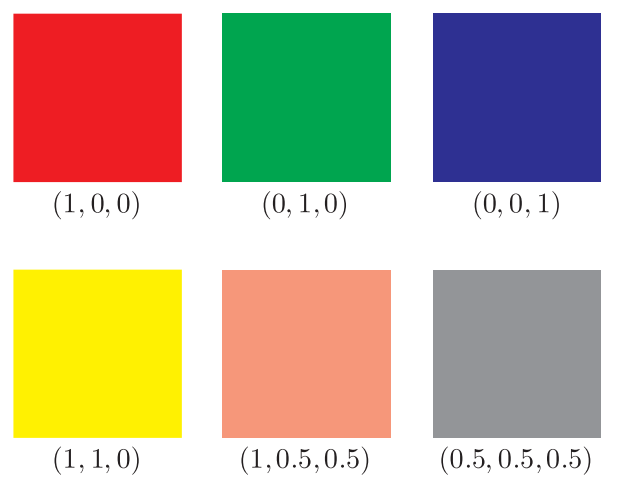
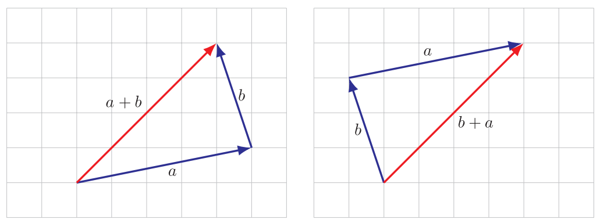

 # Lecture Notes of Linear Algebra []()

These lecture notes were documented when I first learned Linear Algebra online(MIT 18.06 Linear Algebra). Since I am now resolved to incline to computational design rather than traditional architectural design, I feel compelled to review these knowledge. I am trying to revise the notes into digital format.


The following libraries are required among these Jupyter Notebooks.

- [x] Matplotlib
- [x] NumPy
- [x] Python
- [x] SymPy


# 1.Vector

## 1.1 Definition

:pushpin: **vector**

It is a sequence of finite numbers / values. Normally it looks something like this:
$$
\begin{bmatrix}1\\2\\3\end{bmatrix}
\text{or}
\begin{pmatrix}1\\2\\3\end{pmatrix}
$$


:pushpin: **elements/entries/coefficients/components**

The above 4 names are the same. Naming, the individual element of a vector.


:pushpin:**size/dimension/length**

They are the same, naming how long is the vector.


:pushpin:**scalar and vector**

There are *real scalar*$\mathbb{R}$ and *complex scalar*$\mathbb{C}$. In most case, we refer *real scalar* as *scalar*.

Therefore, we also have *real vector* and *complex vector*. In most case, we refer *real vector* as vector.


:pushpin:**block or stacked vector**

Sometimes it is very convenient to *concatenate* or *stack* vectors.

e.g.
$$
a=\begin{bmatrix}a_1\\\vdots\\a_m\end{bmatrix},
b=\begin{bmatrix}b_1\\\vdots\\b_n\end{bmatrix},
c=\begin{bmatrix}c_1\\\vdots\\c_p\end{bmatrix},
\\\\
A=\begin{bmatrix}a_1\\\vdots\\a_m\\b_1\\\vdots\\b_n\\c_1\\\vdots\\c_p\end{bmatrix}
$$


```python
import numpy as np
a = np.array([[1],
              [2],
              [3]])
b = np.array([[4],
              [5],
              [6]])
c = np.array([[7],
              [8],
              [9]])
A = np.vstack([a,b,c])
```


:pushpin:**subvector/slice**

We call $a, b, c$ as the *subvector / slice*  of matrix $A$.


:pushpin: **colon notation and index range**

$a_{r:s}$ means slicing index $r$ to index $s$ elements in vector $a$. The size is $s-r+1$


:pushpin:**indexing**

when you see $a_i$ , there might be 2 different meaning.

- the $i$-th vector in the collection of vectors.
- the $i$-th element in the vector.

Therefore, for clarity. We use

- $a_i$ as the $i$-th vector.
- $(a_i)j$ as the $j$-th element of the $i$-th vector.


:pushpin: **zero vector**

$0_n$ represents a $n$-vector with all 0.


:pushpin: **unit vector**

One unit vector only has one nonzero element.
$$
e_1 = \begin{bmatrix}1\\0\\0\end{bmatrix},
e_2 = \begin{bmatrix}0\\1\\0\end{bmatrix},
e_3 = \begin{bmatrix}0\\0\\1\end{bmatrix}
$$


:pushpin: **Ones Vector**

Size of $n$-vector with all $1$ inside.


:pushpin: **Sparsity**

If there are many zero elements in one vector, then we can say this vector is sparse vector.

The number of nonzero elements in a vector $a$ can be denoted:
$$
nnz(a)
$$

### 1.1.2. Example

In machine learning or computer science, the vector is often saw as *a list of value* more than its mathematical meaning.

```c++
#include <vector>
//...
std:vector<int> ListInt;
```


:pushpin: **Displacement and Location**

A vector can either represents a *location* or a *displacement*.


:pushpin: **Colors**

The colors can be represented as vectors.




:pushpin: **Quantities**

A $n$-vector can represent amounts of different $n$ products.


:pushpin: **Value Across Population**

A $n$-vector can represent body temperature of different $n$ people.


:pushpin: **Image**

This is much more "machine learning" feel. If per pixel per vector
$$
\text{Pixel}_{i,j}=\begin{bmatrix}0.8\\0.2\\0.3\end{bmatrix}
$$
Then an $8\cross8$ pixels image can be flatten as:
$$
V = \begin{bmatrix}v_1,\cdots,v_n\end{bmatrix}\\
n = 8\cross8\cross3
$$

## 1.2. Vector Addition and Subtraction

Prerequisite: The vectors have to be same shape.
$$
\begin{bmatrix}0\\7\\3\end{bmatrix}+
\begin{bmatrix}1\\2\\0\end{bmatrix}=
\begin{bmatrix}1\\9\\3\end{bmatrix}
$$

### 1.2.1. Properties

:pushpin: **commutative**
$$
a+b = b+a
$$
:pushpin: **associative**

$$
(a+b)+c = a+(b+c)
$$

### 1.2.2. Example

:pushpin: **Displacement**




:pushpin: **Vector as a list of value**

There are lots of example of these.


## 1.3. Scalar-vector multiplication

Nothing special.
$$
(-2)\begin{bmatrix}0\\7\\3\end{bmatrix}=\begin{bmatrix}0\\-14\\-6\end{bmatrix}
$$

### 1.3.1. Property

$\alpha$-scalar

$\beta,\gamma$ -vector

:pushpin: **commutative**

$$
(\beta\gamma)\alpha = \beta(\gamma\alpha)
$$
:pushpin: **associative**
$$
(\beta+\gamma)\alpha = \beta\alpha+\gamma\alpha
$$

### 1.3.2. Example

:pushpin: **Displacement**

Scale the displacement.


### 1.3.3. Linear combination

scalar: $\beta_1,\cdots,\beta_n$

vector: $a_1,\cdots,a_n$

linear combination: $\beta_1\alpha_1+\cdots+\beta_n\alpha_n$, where $\beta_1,\cdots,\beta_n$ called *coefficients* of this linear combination


:pushpin: **Linear combination of unit vectors**

Nothing special, just a linear combination using *unit vectors* as bases.


:pushpin: **Special linear combinations**

*sum* , when $\beta_1=\cdots=\beta_n=1$

*mean* , when $\beta_1=\cdots=\beta_n=\frac{1}{n}$

*affine combination* , when $\beta_1+\cdots+\beta_n=1$

*convex combination / mixture / weighted average* , when *affine combination* $\geq 0$


### 1.3.4. Example

:pushpin: **Displacement**


:pushpin: **Line and Segment**

This is a good example of *affine combination*.

Use $c$ to represent a point on a line formed by $a,b$. Where $\theta$ is a scalar $0\leq\theta\leq1$
$$
c = (1-\theta)a+\theta b
$$


## 1.4. Inner Product(dot product)

:pushpin: **Equation**
$$
a^Tb = a_1b_1+a_2b_2+\cdots+a_nb_n
$$
There are other representation of *dot product*.
$$
\langle a,b\rangle  , \langle a|b\rangle  , (a,b),a\cdot b
$$

### 1.4.1. Properties

$$
\begin{align}
a^Tb &= b^Ta\\
(\gamma a)^Tb &= \gamma(a^Tb)\\
(a+b)^Tc &= a^Tc+b^Tc
\end{align}
$$


$$
(a+b)^T(c+d) = a^Tc+a^Td+b^Tc+b^Td
$$
in short, why the above would work? it is very easy to understand. 

- $(a+b)$ is a vector
- $(c+d)$ is also a vector
- $(a+b)$ has to transpose into $(a+b)^T$ , a.k.a. a row vector
- $(a+b)^T(c+d)$ , row vector * column vector is a *scalar*.  (if their dim are the same)


:pushpin: **$i$-th element**

$e_i$ , $i$-th unit vector

$a$, $n$-vector

$e_{i}^{T}a=a_i$ , this can filter out the $i$-th element of vector $a$. Why? Because except $i$-th column of $e_{i}^{T}$ is $1$, others are all $0$.


:pushpin: **sum**

$$
n\text{-dimension ones vector }\bold{1}\\
\bold{1}^Ta = a_1+\cdots+a_n
$$


:pushpin: **average / mean**

$$
(\bold{1}/n)^Ta = (a_1+\cdots+a_n)/n
$$


:pushpin: **sum of squares**

$$
a^Ta = a_1^2+\cdots+a_n^2
$$

### 1.4.2. Application

:pushpin: **co-occurrence**

$a, b$ are $n$-vectors that describe occurrence.  i.e. each of them is either 1 or 0.

Then the *total sum of co-occurrence* is:
$$
a=(0,1,1,1,1,1,1)\quad b= (1,0,1,0,1,0,0)\\
a^Tb = 2
$$
meaning, there are $2$ co-occurrence.


:pushpin: **weights / features / scores**

$f$ ,  $n$-vector for features, like ages, income, etc.

$w$, $n$-vector for the weights for every feature, like the weight of income maybe 1.3, etc.

$s$ , scalar, the sum of as the credit score for a person.
$$
s = w^Tf
$$


:pushpin: **document sentiment analysis**

$x, n$-vector, standing for $n$ words, each element records the appearance of the word in a book

$t, n$-vector are the corresponding type of the word. `-1=negative, 0=neutral, 1=positive` , e.g. "sad" is `-1`

Then the measure of the sentiment is:
$$
t^Tx
$$


## 1.5. Complexity of vector computation

:pushpin: **computer representation of numbers and vectors**

The real numbers $\mathbb{R}$ are stored in **floating point format**. It is either *64-bits* or *8-bytes*. Therefore, there are $2^{64}$ real numbers in a `x64` computer.


:pushpin: **floating point operation**

When computer carries out arithmetic operation, the result is rounded to the nearest floating point number. The very small error is called **round-off error**. Now you understand why you can't compare the *equality* of `float`.

Because the left hand side and right hand side are not equal sometimes!! But the error between is extremely small.


:pushpin: **flop counts and complexity**

> ​	**flop** = floating point operation per second

> ​	**complexity** ,  2 meanings
>
> > 	1. In theoretical computer science, the term `complexity` is to mean the number of flops of the best method to carry out the computation. It always is denoted as $O$.
> >  	2. In this book, it means the number of flops required by a specific method.


:pushpin: **complexity of vector operation**

- $n$ times
  - scalar-vector multiplication and division of $n$-vector , e.g. $aV$
  - vector addition and subtraction  $n$-vector, e.g. $P+V$
- $2n$ times
  - inner product of  $n$-vectors, e.g. $P^TV = P_1V_1+\cdots+P_nV_n$. Multiplication takes $n$ times, addition takes $n-1$ times. But for simplicity, we denote as $2n$ times.


:pushpin: **complexity of sparse vector operation**

> ​	$x,y$ are sparse vectors.

> ​	$ax$ takes $nnz(x)$ times.

> ​	$x+y$ takes 
>
> > 1. less than $\min\{\bold{nnz}(x),\bold{nnz}(y)\}$ times
> > 2. 0 times if $x$ and $y$ have zero overlapped.

> ​	$x^Ty$ takes
>
> > 1. less than $2\min\{\bold{nnz}(x),\bold{nnz}(y)\}$
> > 2. 0 times if they are not overlapped.


:pushpin: ****


:pushpin: ****


:pushpin: ****


:pushpin: ****


:pushpin: ****


:pushpin: ****


:pushpin: ****


:pushpin: ****


:pushpin: ****


:pushpin: ****


