<div align="center">
    <h1>
        Differentiation
    </h1>
</div>

# 0.Limits

## 0.0. Introduction to limits

### Summary⭐

📌**Definition of right-hand and left-hand limits**

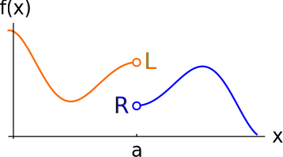

> ​	📍<u>Right-hand limit</u>

Suppose $f(x)$ gets really close to $R$ for values of $x$ that get really close to (*but are not equal to*) $a$ **from the right**. Then we say $R$ is the **right-hand limit** of the function $f(x)$ as $x$ approaches $a$ from the right.

We write:
$$
f(x)\to R \space \text{as}\space x\to a^+\\
\text{or}\\
\lim_{x\to a^+}f(x)=R
$$

> ​	📍<u>Left-hand limit</u>

Suppose $f(x)$ gets really close to $L$ for values of $x$ that get really close to (*but are not equal to*) $a$ **from the left**. Then we say $L$ is the **left-hand limit** of the function $f(x)$ as $x$ approaches $a$ from the left.

We write:
$$
f(x)\to L \space \text{as} \space x\to a^-\\
\text{or}\\
\lim_{x\to a^-}f(x)=L
$$


📌**Possible limit behaviors**

| Index | Right-hand limit | Left-hand limit | R & L                                        | Example                                                      | Image                                                        |
| ----- | ---------------- | --------------- | -------------------------------------------- | ------------------------------------------------------------ | ------------------------------------------------------------ |
| 1️⃣     | exist✔           | exist✔          | $=$✔exist and equal                          | $f(x)=x^2$<br>looks at $x=0$                                 | 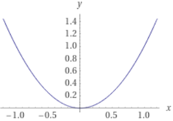 |
| 2️⃣     | exist✔           | exist✔          | $\neq$❌exist but not equal                   | $f(x) = \frac{\sqrt{(3-5x+x^3+x^2)}}{(x-1)}$<br>looks at $x=1$ | 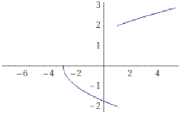 |
| 3️⃣     | not exist❌       | not exist❌      | ❌$L$&$R$ both blows up to $\pm\infin$        | $f(x)=\frac{1}{x}$<br>looks at $x=0$                         | 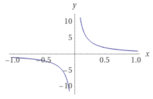 |
| 4️⃣     | not exist❌       | not exist❌      | ❌oscillates and never settle down to a value | $f(x)=\sin(13/x)$<br>looks at $x=0$                          | 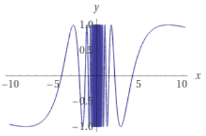  |


📌**Limit Definition⭐**

> ​	📍<u>The Limit in Words</u>

If a function $f(x)$ <u>**approaches**</u> some value $L$ as $x$ approaches $a$ from <u>**both**</u> *the right and the left*, then the limit of $f(x)$ exists and equals $L$.


> ​	📍<u>The Limit in Symbols</u>

If
$$
\lim_{x\to a^+}f(x)=\lim_{x\to a^-}f(x)=L
$$
then
$$
\lim_{x\to a}f(x)=L
$$
Alternatively,
$$
f(x)\to L \quad \text{as} \quad x\to a
$$
Remember that $x$ is <u>approaching</u> $a$ but does **not equal** $a$.


📌**The Limit Laws**

Suppose:
$$
\lim_{x\to a}f(x)=L,\quad \lim_{x\to a}g(x)=M
$$
Then we get the following Limit Laws:

> ​	📍Limit Law for Addition

$$
\lim_{x\to a}[f(x)+g(x)]=L+M
$$

> ​	📍Limit Law for Subtraction

$$
\lim_{x\to a}[f(x)-g(x)]=L-M
$$

> ​	📍Limit Law for Multiplication

$$
\lim_{x\to a}[f(x)\cdot g(x)]=L\cdot M
$$

> ​	📍Limit Law for Division(part 1)

$$
\lim_{x\to a}\frac{f(x)}{g(x)}=\frac{L}{M}
$$

### Example

📌**Example: $L\neq R$**

The following example demonstrates the left-hand limit and right-hand limit may not be equal at $x=1$.
$$
f(x) = \frac{\sqrt{(3-5x+x^3+x^2)}}{(x-1)}
$$
To calculate the limit, we can approaches the value as follow:
$$
L\begin{cases}x=0\\x=0.5\\x=0.9\\x=0.99\end{cases}
R\begin{cases}x=2\\x=1.5\\x=1.1\\x=1.01\end{cases}
$$

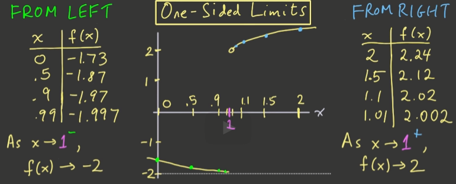


📌**Example of $DNE$**

$DNE$ stands for <u>does not exist</u>.

Considering:
$$
j(x)=\sin(13/x), \text{what is }\lim_{x\to 0^+}j(x)?
$$

```c++
int main()
{
	std::cout << "j(x) = sin(13/x)" << std::endl;
	std::cout << Calculate(1) << std::endl;
	std::cout << Calculate(0.5) << std::endl;
	std::cout << Calculate(0.1) << std::endl;
	std::cout << Calculate(0.01) << std::endl;
	return 0;
}

double Calculate(double x)
{
    return sin(13/x);
}
```

The result seems weird:

```bash
➜  calculate_limit git:(main) ✗ ./main.exe
j(x) = sin(13/x)
0.420167
0.762558
-0.930106
-0.580513
```

it oscillates and **never settle down** to a value.


📌**Example: Graph including most behaviors**

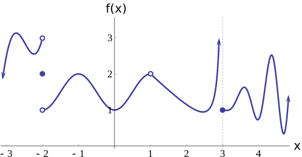
$$
\begin{align}
\lim_{x\to(-2)^-}f(x)&=3\\
\lim_{x\to(-2)^+}f(x)&=1\\
\lim_{x\to(-2)}f(x)&=DNE\\
f(-2)&=2\\
\\\\
\lim_{x\to1^-}f(x)&=2\\
\lim_{x\to1^+}f(x)&=2\\
\lim_{x\to1}f(x)&=2\\
f(1)&=DNE\\
\\\\
\lim_{x\to3^-}f(x)&=DNE\\
\lim_{x\to3^+}f(x)&=1\\
\lim_{x\to3}f(x)&=DNE\\
f(3)&=1\\
\end{align}
$$
1️⃣If $L/R$ exists, the other one does not have to exist.  e.g. $x=3$

2️⃣$L$ not have to equal $R$, vice versa. e.g. $x=-2,x=3$

3️⃣If $\lim_{x\to a}=K$, $f(a)$ does not have to be $K$.   e.g.$x=1$ 


📌**Example: Floor Function**

The floor function is quite fun. Please take some time taste the following graph and equations.

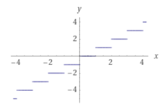
$$
\begin{align}
\lim_{x\to2^-}\lfloor x\rfloor&=1\\
\lim_{x\to2^+}\lfloor x\rfloor&=2\\
\lim_{x\to2}\lfloor x\rfloor&=DNE\\
\lfloor2\rfloor&=2
\end{align}
$$


## 0.1. Continuity

### Summary⭐

📌**Definition of *continuity* at a point**

We say that a function $f$ is **continuous at a point** $x=a$ if
$$
\lim_{x\to a}f(x) = f(a)
$$
In particular, if either $f(a)$ or $\lim_{x\to a}f(x)$ fails to exist, then $f$ is discontinuous at $a$.


We say that a function is **right-continuous at a point** $x=a$ if $\lim_{x\to a^+}f(x) = f(a)$

We say that a function is **left-continuous at a point** $x=a$ if $\lim_{x\to a^-}f(x) = f(a)$


📌**Types of Discontinuities**

> ​	📍Jump Discontinuity

If the left-hand limit $\lim_{x\to a^-}$ and the right-hand limit $\lim_{x\to a^+}$ both exist at a point $x=a$, but they are not equal, then we say that $f$ has a **jump discontinuity** at $x=a$.

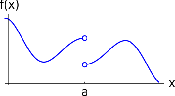

> ​	📍Removable Discontinuity

If the overall limit $\lim_{x\to a}f(x)$ exists (i.e., the left- and right-hand limits agree), but the overall limit does not equal $f(a)$, then we say that $f$ has a **removable discontinuity** at $x=a$.

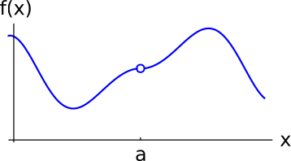


📌**Definition of continuous function**

A function $f(x)$ is continuous if for every point $c$ in the domain of $f(x)$ , the function $f$ is continuous at the point $x=c$.


📌**Basic Continuous Functions**

> ​	The following functions are continuous at ***all real numbers***:

- all polynomials
- $\sqrt[3]{x}$
- $\abs{x}$
- $\cos x$ and $\sin x$
- exponential function $a^x$ with base $a>0$

> ​	The following functions are continuous ***at the specified values*** of $x$:

- $\sqrt{x}$, for $x>0$
- $\tan x$, at all $x$ where it is defined
- logarithmic functions $\log_{a}x$ with base $a>0$, for $x>0$


📌**Limit laws and continuity**

If the function $f$ and $g$ are continuous everywhere, then:

- $f+g$ is continuous everywhere
- $f-g$ is continuous everywhere
- $f\cdot g$ is continuous everywhere
- $f\circ g$ is continuous everywhere,  ($\circ$ means compose, e.g. $f(g(x))$)
- $\frac{f}{g}$ is continuous where it is defined.


📌**Intermediate Value Theorem**

if $f$ is a function which is continuous on the interval $[a,b]$ and $M$ lies between the value $f(a)$ and $f(b)$, then there is at least one point $c$ between $a$ and $b$ such that $f(c)=M$

(A function is **continuous on a closed interval** $[a,b]$ if it is right-continuous at $a$, left-continuous at $b$, and continuous at all points between $a$ and $b$.)

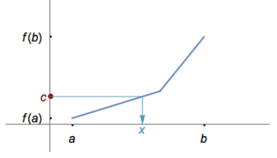

### Example

📌**Example: Graph with Continuity**

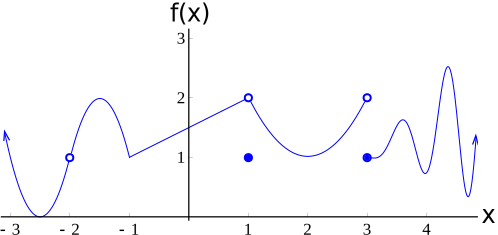

| At     | Left-continuous | Right-continuous | Continuous | Removable Discontinuity | Jump Discontinuity |
| ------ | --------------- | ---------------- | ---------- | ----------------------- | ------------------ |
| $x=-2$ | ❌               | ❌                | ❌          | ⭕                       |                    |
| $x=-1$ | ✔               | ✔                | ✔          |                         |                    |
| $x=1$  | ❌               | ❌                | ❌          | ⭕                       |                    |
| $x=3$  | ❌               | ✔                | ❌          |                         | ⭕                  |
| $x=4$  | ✔               | ✔                | ✔          |                         |                    |


📌**Example: $f,g$ not continuous, but $f+g$ might be continuous**

In the summary section, we know that if the function $f$ and $g$ are continuous everywhere, then $f+g$ is continuous everywhere.

But on the **contrary**, if $f,g$ are not continuous, $f+g$ might be continuous!
$$
\begin{align}
f(x)&=\lfloor x \rfloor\\
g(x)&=-\lfloor x \rfloor\\
f(x)+g(x)&=\bold{0}
\end{align}
$$
Constant $\bold{0}$ is continuous everywhere.


📌**Example: Suppose that $f(1)=2$ and $f(4)=4$ . Must the graph $f$ of intersect the line $y=3$?**

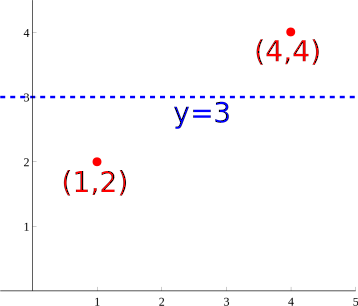

Not really. Because it doesn't say this is a continuous function. Therefore the following function need not to intersect with the line.

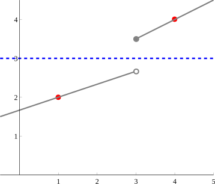


### Misc

📌**What makes the Intermediate Value Theorem a deep result?**

The Intermediate Value Theorem is <u>**profound**</u> because it <u>takes information that is local</u> by nature, and allows you to <u>conclude a global result</u>. Continuity at a point is local information, because it only requires knowledge of the function's behavior near that point. But somehow, if we know this fact at every point on an interval, then the Intermediate Value Theorem tells us something about the overall, or global behavior - namely, that the function has to take on a particular value, or its graph has to cross a certain line.


## 0.2. Limits of quotients

### Summary⭐

📌**Limit Law for Division**

If:
$$
\lim_{x\to a}f(x)=L\quad\text{and } \lim_{x\to a}g(x)=M
$$
then:
$$
\begin{align}
\text{Case 1: If }&M\neq0,\text{then }\lim_{x\to a}\frac{f(x)}{g(x)}=\frac{L}{M}\\
\text{Case 2: If }&M=0,\text{but }L\neq0,\text{then }\lim_{x\to a}\frac{f(x)}{g(x)}\text{ does not exist}\\
\text{Case 3: If both }&M=0\text{ and }L=0,\text{then }\lim_{x\to a}\frac{f(x)}{g(x)}\text{might be exist, or it might not exist.}
\end{align}
$$
Regarding the 3rd situation, More work is necessary to determine whether the last type of limit exists, and what it is if it does exist.


### Example

📌**Example - Limit Laws**

Suppose that:
$$
\lim_{x\to-1}f(x)=0, \lim_{x\to-1}g(x)=17, \lim_{x\to-1}h(x)=0
$$
We have:
$$
\begin{align}
\lim_{x\to-1}g(x)h(x)&=0\\
\lim_{x\to-1}\frac{g(x)}{f(x)}&=DNE\\
\lim_{x\to-1}f(x)+g(x)+h(x)&=17\\
\lim_{x\to-1}\frac{f(x)}{h(x)}&=\text{Cannot be determined based on the information given}\\
\lim_{x\to-1}\frac{f(x)+h(x)}{g(x)}&=0
\end{align}
$$


**📌Example of dealing with Case 3**

Normally, when you encounter polynomial function, you would need a **<u>factorization</u>**.

> ​	since $x^2+2x-3=0,\quad x^2-3x+2=0 \quad \text{when }x=0$, therefore we need to factorization.

$$
\begin{align}
\lim_{x\to1}\frac{x^2+2x-3}{x^2-3x+2} &= \lim_{x\to1}\frac{(x-1)(x+3)}{(x-1)(x-2)}\\
&=\lim_{x\to1}\frac{\cancel{(x-1)}(x+3)}{\cancel{(x-1)}(x-2)}\\
&=-4
\end{align}
$$


> ​	since $x+1=0,\quad x+\frac{1}{x}+2=0 \quad \text{when }x=-1$, therefore we need to factorization.

$$
\begin{align}
\lim_{x\to-1}\frac{x+1}{x+\frac{1}{x}+2}&=\lim_{x\to-1}\frac{x(x+1)}{x(x+\frac{1}{x}+2)}\\
&=\lim_{x\to-1}\frac{x^2+x}{x^2+1+2x}\\
&=\lim_{x\to-1}\frac{x(x+1)}{(x+1)(x+1)}\\
&=\lim_{x\to-1}\frac{x\cancel{(x+1)}}{(x+1)\cancel{(x+1)}}\\
&=\lim_{x\to-1}\frac{-1}{0}\\
&=DNE
\end{align}
$$


📌**More Example - Division Limit**

> ​	$\text{Case 1: If }&M\neq0,\text{then }\lim_{x\to a}\frac{f(x)}{g(x)}=\frac{L}{M}\\$

$$
\begin{align}
\lim_{x\to2}\frac{1/x+x^2}{x-3}&=\frac{4.5}{-1}=-4.5\quad\text{(Case 1)}\\
\end{align}
$$


> ​	$\text{Case 2: If }&M=0,\text{but }L\neq0,\text{then }\lim_{x\to a}\frac{f(x)}{g(x)}\text{ does not exist}\\$

$$
\begin{align}
\lim_{x\to0^+}\frac{2\cos x+1}{x^2+x}&=\frac{2\cross1+1}{0+0} = DNE\quad\text{(Case 2)}\\
\end{align}
$$


> ​	$\text{Case 3: If both }M=0\text{ and }L=0,\text{then }\lim_{x\to a}\frac{f(x)}{g(x)}\text{might be exist, or it might not exist.}$

======>factorization
$$
\begin{align}
\lim_{x\to2}\frac{12/x-3x}{2-3x+x^2}&=-6\quad\text{(Case 3, elaborate👇)}\\
&=\lim_{x\to2}\frac{x(12/x-3x)}{x(2-3x+x^2)}\\
&=\lim_{x\to2}\frac{12-3x^2}{x(x^2-3x+2)}\\
&=\lim_{x\to2}-\frac{3x^2-12}{x(x^2-3x+2)}\\
&=\lim_{x\to2}-\frac{3(x^2-4)}{x(x^2-3x+2)}\\
&=\lim_{x\to2}-\frac{3(x+2)(x-2)}{x(x-1)(x-2)}\\
&=\lim_{x\to2}-\frac{3(x+2)\cancel{(x-2)}}{x(x-1)\cancel{(x-2)}}\\
&=\lim_{x\to2}-\frac{3(2+2)}{2(2-1)}=-6
\end{align}
$$


======>factorization
$$
\begin{align}
\lim_{x\to3}\frac{2x^2-10x+12}{x^3-6x^2+9x}&=\lim_{x\to3}\frac{2(x^2-5x+6)}{x(x^2-6x+9)}\\
&=\lim_{x\to3}\frac{2(x-2)(x-3)}{x(x-3)^2}\\
&=\lim_{x\to3}\frac{2(x-2)}{x(x-3)}\\
&=\lim_{x\to3}\frac{2(3-2)}{3(3-3)}\\
&=\lim_{x\to3}\frac{2\cross1}{0}\\
\text{therefore, the result is }DNE
\end{align}
$$


======>factorization
$$
\begin{align}
\lim_{x\to0}\frac{3x^3+x^2}{x^3+x^2+x}&=\lim_{x\to0}\frac{x^2(3x+1)}{x^2(x+1+\frac{1}{x})}\\
&=\lim_{x\to0}\frac{3x+1}{x+1+\frac{1}{x}}\\
&=\lim_{x\to0}\frac{3\cross0+1}{0+1+\frac{1}{0}}\\
&=\lim_{x\to0}\frac{1}{1+\infin}\\
&=\text{because denominator is + infinity, therefore the whole is 0}\\
&=0
\end{align}
$$


======>factorization
$$
\begin{align}
\lim_{x\to-1}\frac{2x^2+7x+5}{x+1} &= \lim_{x\to-1}\frac{2(x^2+\frac{7}{2}x+\frac{5}{2})}{x+1}\\
&= \lim_{x\to-1}\frac{2(x+1)(x+\frac{5}{2})}{x+1}\\
&= \lim_{x\to-1}\frac{2\cancel{(x+1)}(x+\frac{5}{2})}{\cancel{x+1}}\\
&= \lim_{x\to-1}2(-1+\frac{5}{2})=3\\
\end{align}
$$


**📌$DNE$ Speaking in <u>both</u> left-hand <u>and</u> right-hand**

> ​	Q: Given the results for $\lim_{x\to0^-}\frac{1}{x}$ and $\lim_{x\to0^+}\frac{1}{x}$, what should we say about $\lim_{x\to0}\frac{1}{x}$?

> ​	A: The limit does not exist($DNE$), and it is neither $+\infin$ nor $-\infin$. Let's look at the graph.

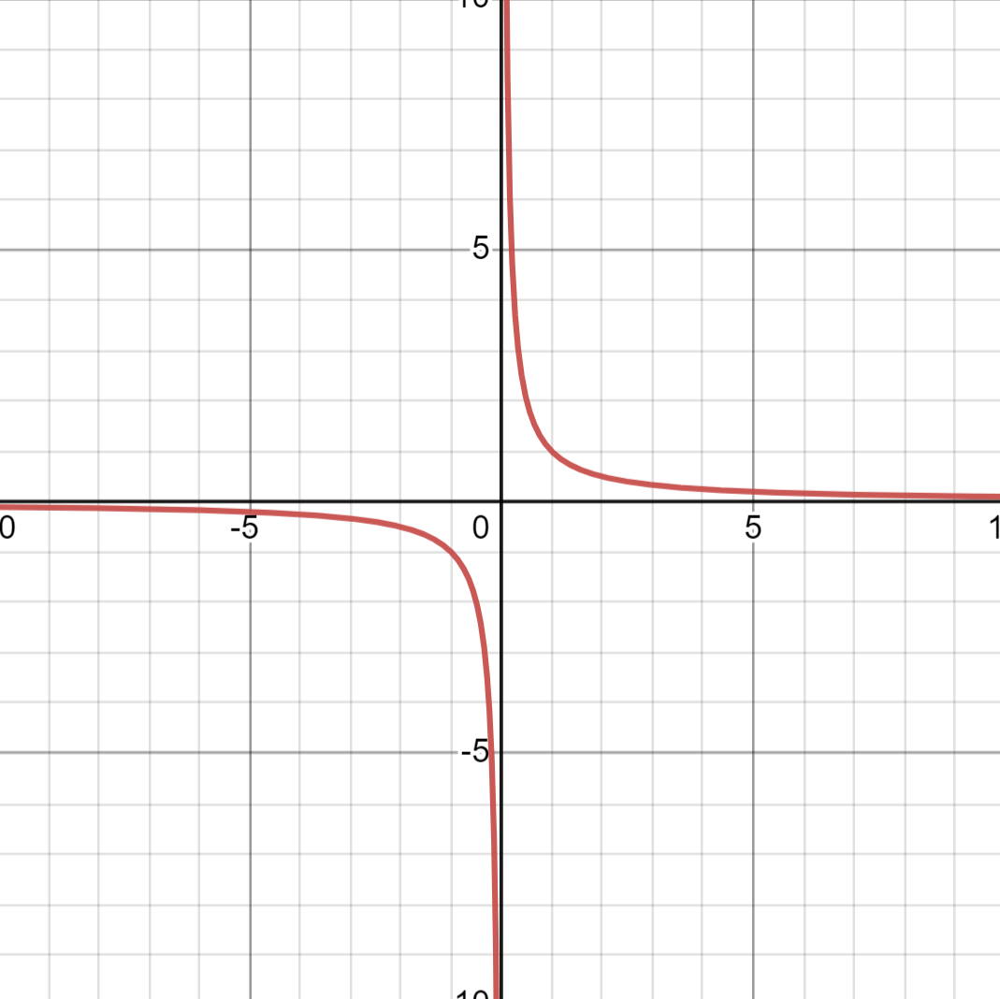


**📌$DNE$ Speaking in <u>either</u> both left-hand <u>or</u> right-hand**

We can split it into left-hand and right-hand which are:
$$
\lim_{x\to2^-} \frac{3x}{4-x^2} \text{and }\lim_{x\to2^+} \frac{3x}{4-x^2}
$$

The difference is that:

- in $x\to2^-$, the result of $4-x^2$ is very close to $0$ but $4>x^2$(positive), therefore $\lim_{x\to2^-} \frac{3x}{4-x^2}=+\infin$
- in $x\to2^+$, the result of $4-x^2$ is very close to $0$ but $4<x^2$(negative), therefore $\lim_{x\to2^+} \frac{3x}{4-x^2}=-\infin$

And we can see it from the following graph:

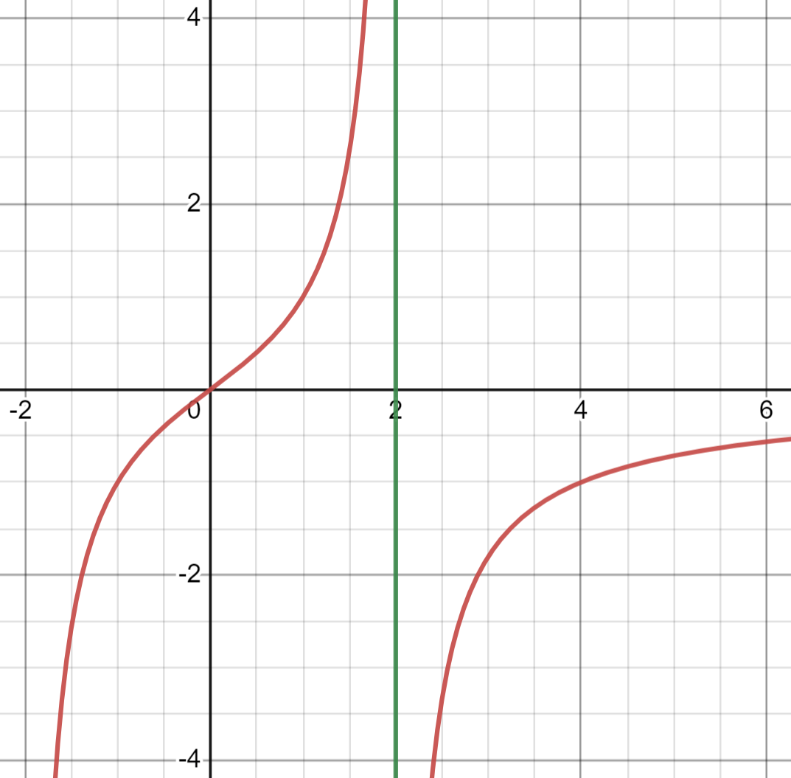


## 0.3. Homework

**📌Quiz**

Why $x^{3/2}+4$ is not continuous?

Because it is not defined where $x<0$ so therefore it is not continuous for all reall $x$.


**📌Quiz**

The root $a$ of a polynomial $p(x)$ has multiplicity $m$ if $(x-a)^m$ is the largest power of $x-a$ that is a factor of $p$. In other words, , $p(x)=(x-a)^ms(x)$where $s(x)$ is a polynomial for which $a$ is not a root.


> ​	Description: The numerator and denominator <u>**can't not be canceled**</u> since the <u>root is different</u>!!


Q1️⃣: If $a$ is a root of multiplicity 5 for the polynomial $p$, and a root of multiplicity 7 for the polynomial $q$, what might be $\lim_{x\to a}\frac{p(x)}{q(x)}$? 

- [ ] 0
- [ ] 1
- [ ] -1
- [ ] 3
- [x] It does not exist

> ​	Explain: The denominator wins in the race to 0 so the limit is not defined.


Q2️⃣: If $a$ is a root of multiplicity 8 for the polynomial $p$, and a root of multiplicity 4 for the polynomial $q$, what might be $\lim_{x\to a}\frac{p(x)}{q(x)}$? 

- [x] 0
- [ ] 1
- [ ] -1
- [ ] 3
- [ ] It does not exist

> ​	Explain: The numerator wins the race to 0, so the limit is 0.


Q3️⃣: If $a$ is a root of multiplicity 6 for the polynomial $p$, and a root of multiplicity 6 for the polynomial $q$, what might be $\lim_{x\to a}\frac{p(x)}{q(x)}$? 

- [ ] 0
- [x] 1
- [x] -1
- [x] 3
- [ ] It does not exist

> ​	Explain: Both numerator and denominator are competing in the race towards zero, so the limit could be any finite, nonzero number!


**📌Quiz**

Let $f(x)=\frac{x-\sqrt[3]x+\cos x}{x^2-4}$ We have calculated the following values of $f$:
$$
\begin{align}
f(-3)&=-.51\\
f(-2.25)&=-1.48\\
f(-1.5)&=.16\\
f(-.75)&=-.26\\
f(0)&=-.25\\
f(.75)&=-.17\\
f(1.5)&=-.24\\
f(2.25)&=.29\\
f(3)&=.11\\
\end{align}
$$
The number of roots of $f$ is **<u>at least</u>** **1**.

We know that this function is not continuous at $\pm2$ and therefore we need to consider that dividing the region into:
$$
(-\infin,-2),(-2,2),(2,+\infin)
$$


# 1.Derivative

## 1.0. What is Derivative?

### Summary⭐

**📌Definition of the derivative**

The **derivative** of a function $f(x)$ at a point $x=a$ is defined to be:
$$
f'(a)=\lim_{b\to a}\frac{f(b)-f(a)}{b-a}
$$
There is also an alternative definition:
$$
f'(a)=\lim_{h\to0}\frac{f(a+h)-f(a)}{h}
$$


**📌The Philosophy of Derivative**

We care about the <u>derivative</u> of $f(x)$ at $x=a$ is <u>**instant rate of change**</u> of $f(x)$ at $x=a$.


### Example

We will take a look on the following example:

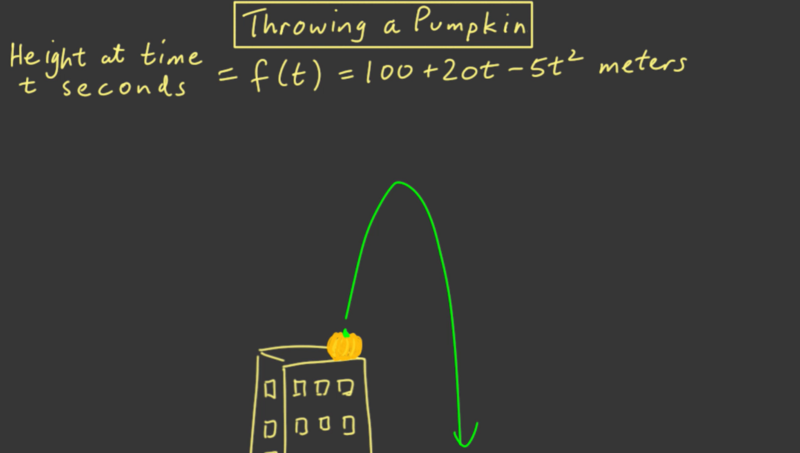

> ​	Q: the average velocity between $t=0$ and $t=1$

That would be:
$$
\begin{align}
\text{average velocity}&=\frac{f(1)-f(0)}{1-0}\\
&=\frac{100+20\cross1-5\cross1^2-(100+20\cross0-5\cross0^2)}{1}\\
&=15\text{m/s}
\end{align}
$$

> ​	Q: instantaneous velocity at $t=1$

That would be:
$$
\begin{align}
\text{instantaneous velocity}&=f'(1)\\&=\lim_{b\to1}\frac{f(b)-f(1)}{b-1}\\
&=\lim_{b\to1}\frac{100+20b-5b^2-(100+20-5)}{b-1}\\
&=\lim_{b\to1}\frac{20b-5b^2-15}{b-1}\\
&=\lim_{b\to1}\frac{-5(b^2-4b+3)}{b-1}\\
&=\lim_{b\to1}\frac{-5(b-1)(b-3)}{b-1}\\
&=\lim_{b\to1}\frac{-5\cancel{(b-1)}(b-3)}{\cancel{b-1}}\\&=-5\cross(-2)=10\text{ m/s}
\end{align}
$$

### Misc

Calculus is all about variables changing.


## 1.1. Geometric interpretation of the derivative

### Summary⭐

**📌3 Main Interpretation of Derivative**

There are:

- physical -  instantaneous rate of change.
- geometrical - the slope of the tangent line.
- sensitive - the sensitivity of a function to small changes.


**📌Tangent Line**

> ​	Definition

The **tangent line** to a function $f(x)$ at the point $x=a$ is the line that passes through the point $(a,f(a))$, and whose slope is the instantaneous rate of change of $f(x)$ at the point $x=a$. This slope is the slope of the line you get <u>**if you imagine zooming in on the function until it looks like a line**</u>.

Property of a tangent line:

- Point $(a,f(a))$
- Slope $m, \text{where }m=f'(a)$

Diagram:

<div align="center">
    <figure>
        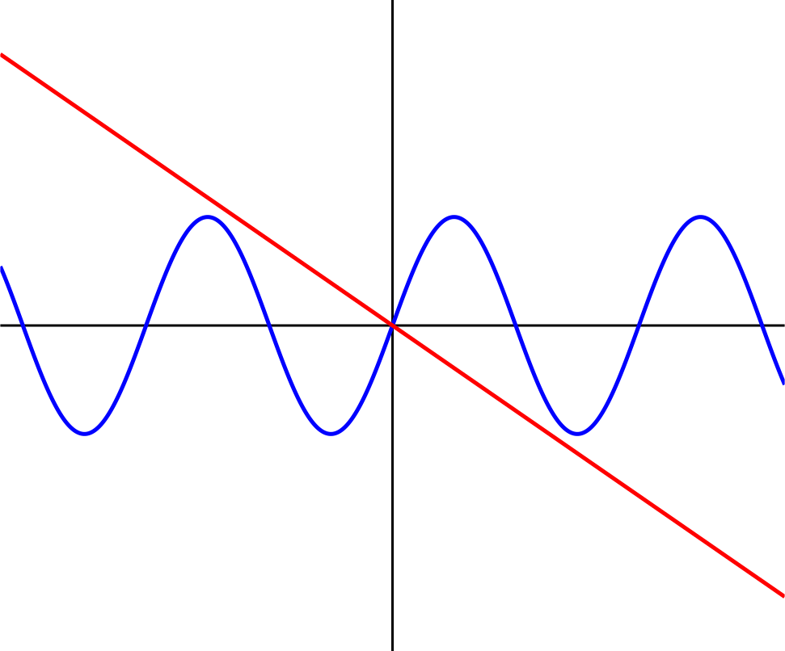
        <figcaption>Is Not a tangent line</figcaption>
	</figure>
    <figure>
        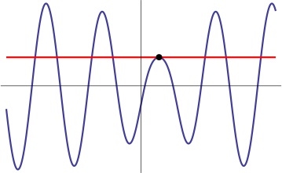
        <figcaption>Is a tangent line</figcaption>
	</figure>
</div>


**📌Secant Line**

> ​	Definition

The **secant line** of a function $f(x)$ over the interval $a\leq x\leq b$, is the line that passes through the points $(a,f(a))$ and $(b,f(b))$.


> ​	Slope

The slope of the secant line is 
$$
\text{slope}=\frac{\Delta y}{\Delta x}=\frac{f(b)-f(a)}{b-a}
$$
, which is the <u>**average rate of change**</u> of the function $f(x)$ over the interval $a\leq x\leq b$.


> ​	Equation

The equation for the secant line is:
$$
y=\frac{f(b)-f(a)}{b-a}(x-a)+f(a)
$$


> ​	Chinese Name

The secant line in Chinese is "正切线".


> ​	Diagram

<div align="center">
    <figure>
        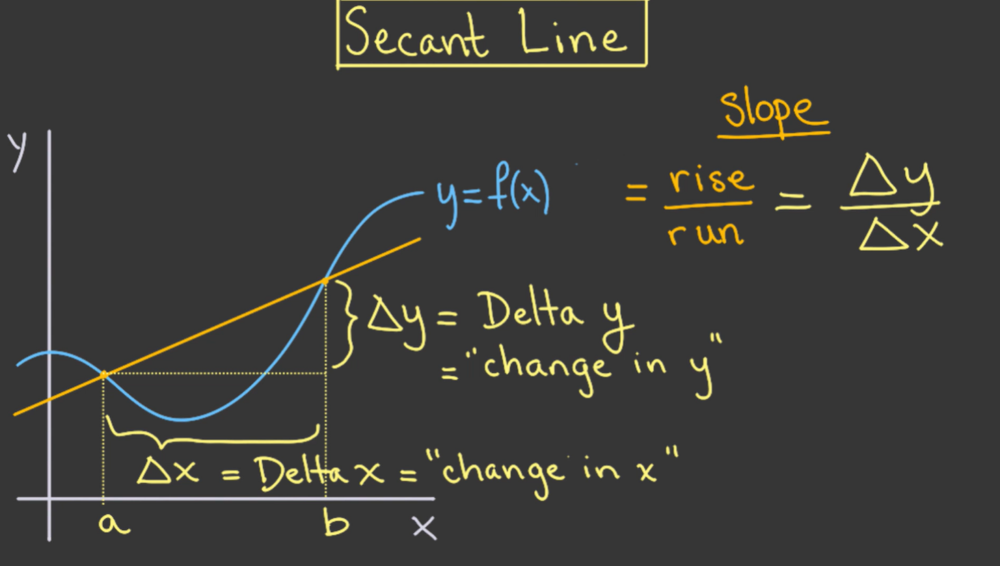
        <figcaption>A secant line</figcaption>
</figure>
</div>


**📌The effect of adding $\lim_{b\to a}$**

Math is amazing, these different interpretation somehow are correlated altogether!! If we were speaking in the philosophy of "limit", everything is different and fun!
$$
\begin{align}
\text{geometric: }&  &\text{slope of secant line}\quad&\text{---}\lim_{b\to a}\text{-->} &\text{slope of tangent line}\\
\text{symbolic: }&   &\frac{f(b)-f(a)}{b-a}\quad&\text{---}\lim_{b\to a}\text{-->} &f'(a)\\
\text{physical: }&   &\text{average rate of change}\quad&\text{---}\lim_{b\to a}\text{-->} &\text{instantaneous rate of change}\\
\end{align}
$$


**📌Relationship: Differentiable vs. Continuous**

The following is true.✔
$$
\text{function is continuous at x=a}\in\text{function is differentiable at x=a}
$$
However, the reverse is wrong.❌ Look at $x=0$ at $f(x)=\abs{x}$

<div align="center">
    <figure>
        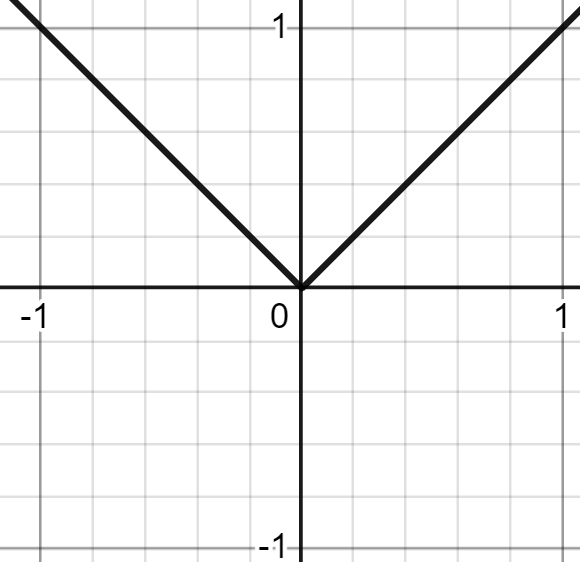
        <figcaption>Function is continuous but not differentiable at x=0</figcaption>
</figure>
</div>


**📌Relationship: Tangent Line vs. Derivative**

The following is true:✔
$$
\text{function has a tangent line at x=a}\in\text{function has derivative  at x=a}
$$
However, the reverse is wrong.❌ Look at $x=0$ at $f(x)=\sqrt[3]{x}$

<div align="center">
    <figure>
        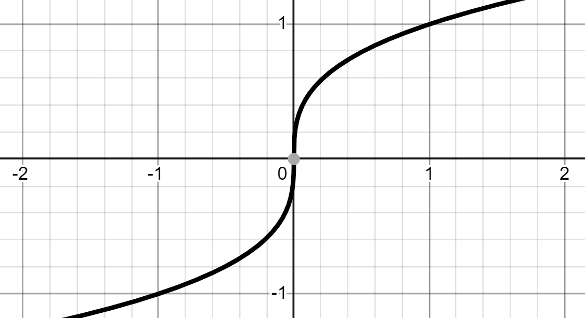
        <figcaption>Function has a tangent line but not differentiable at x=0</figcaption>
</figure>
</div>


### Example

**📌Example on Limits, Continuous, and Differentiable**

Let's look at the $x=0$ of the following function $f(x)=\abs{x}$:

<div align="center">
    <figure>
        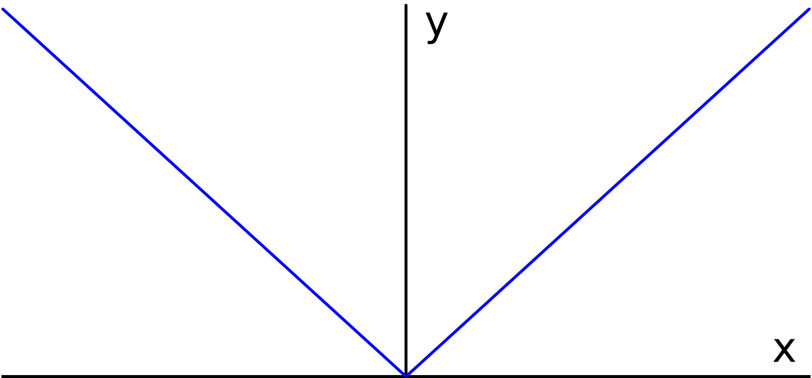
        <figcaption>Absolute function</figcaption>
</figure>
</div>

> ​	Limits✔:

The <u>left-hand limit</u> and <u>right-hand limit</u> are the same. Therefore the limit at $x=0$ exist.
$$
\begin{align}
\lim_{x\to0^-}\abs{x}=0\\
\lim_{x\to0^+}\abs{x}=0\\
\lim_{x\to0}\abs{x}=0\\
\end{align}
$$


> ​	Continuous✔:

Since
$$
\lim_{x\to0^-}\abs{x}=0=\lim_{x\to0^+}\abs{x}=f(x)=0
$$
Therefore the function is continuous.


> ​	Differentiable❌:

It is not differentiable at $x=0$, because
$$
\begin{align}
\lim_{x\to0^-}\frac{\abs{x}-0}{x-0}&=-1\\
\lim_{x\to0^+}\frac{\abs{x}-0}{x-0}&=1\\
\end{align}
$$
We have a name of the preceding derivative:

- <u>**left-sided derivative**</u>, denoted as $f'(0^-)=\lim_{x\to0^-}\frac{f(x)-f(x)}{x-0}$
- <u>**right-sided derivative**</u>, denoted as $f'(0^+)=\lim_{x\to0^+}\frac{f(x)-f(x)}{x-0}$


**📌Example - Derivative of a Jump Discontinuity Function**

Take a look at the following function:

<div align="center">
    <figure>
        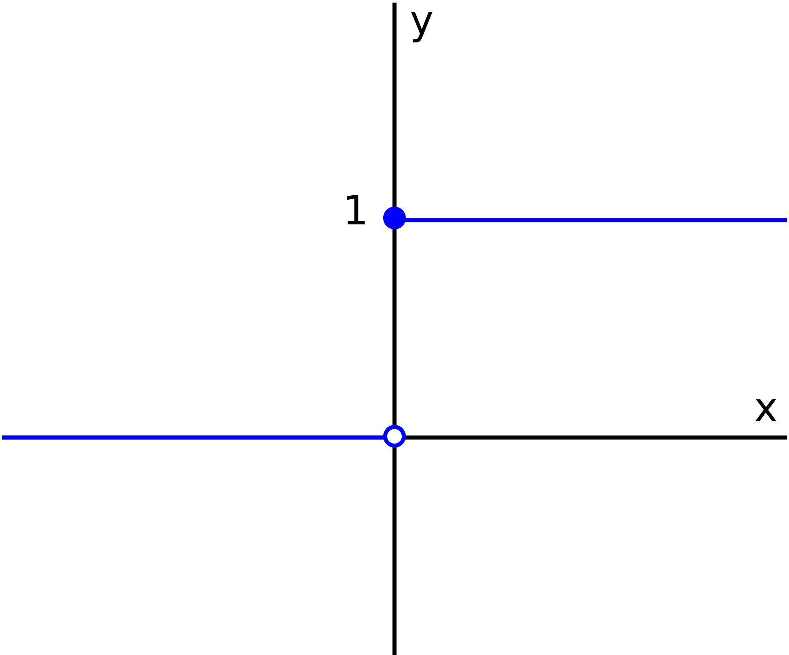
        <figcaption>Jump Discontinuity Function</figcaption>
</figure>
</div>

The <u>**right-sided derivative**</u> is easy, which is:
$$
f'(0^+)=1
$$
However, we sometime may make mistake on the <u>**left-sided derivative**</u>:
$$
f'(0^-)=\infin
$$
It is infinity rather 0!! Why? Please recall how to calculate the derivative - some value close to $x=0$ and $x=-0.001$, that line is <u>**hell vertical line**</u>😲😲! The similar function is the following:
$$
f(x) = \sqrt[3]{x}
$$

<div align="center">
    <figure>
        
        <figcaption>Vertical tangent line at x=0</figcaption>
</figure>
</div>

Therefore it is not differentiable at $x=0$.


**📌Example on Derivative**

<div align="center">
    <figure>
        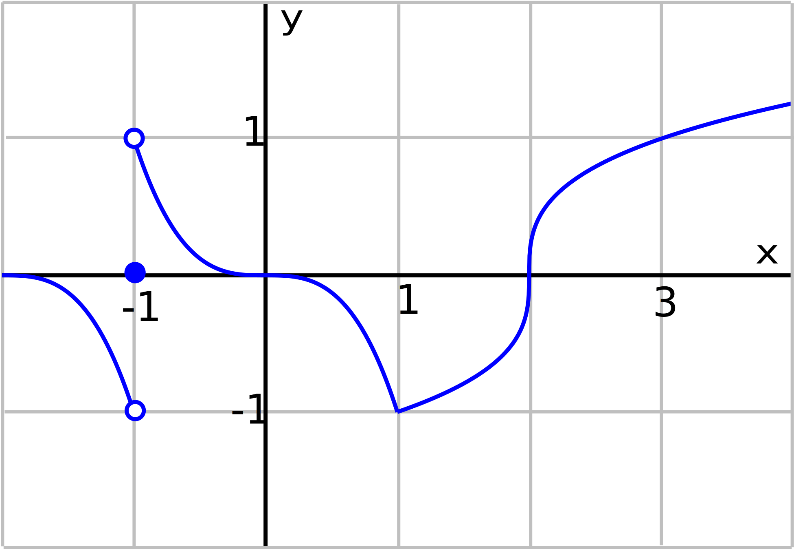
</figure>
</div>

The following are the derivatives:
$$
\begin{align}
f'(-1)&=DNE\\
f'(0)&=0\\
f'(1)&=DNE\\
f'(2)&=DNE\\
f'(3)&=1/3\\
\end{align}
$$


### Misc

**📌Interpretation of Linear Equation[^1]**

If I recall the derivative in my college, I remember that the derivative of a linear function is a constant. Before this class, I only 死记硬背 this rule. But now I can see in the geometrical perspective.

<div align="center">
    <figure>
        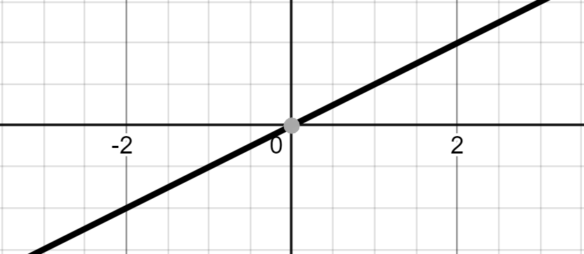
        <figcaption>Linear equation</figcaption>
</figure>
</div>


Because <u>**the slope is always the same**</u> no matter what $x$ is, therefore the derivative of <u>a linear equation is a constant</u>.


**📌Review Questions**

> Q: If it exists, the derivative of a function at a point is a:

- [ ] Line
- [x] Number
- [ ] Point
- [ ] Function

The derivative at a point is related to the tangent line at that point, but <u>**it is not the line itself**</u> - it is **the line's slope**. That's a number.


> ​	Q: True or false: A tangent line to the graph of $f$ at $(a,f(a))$ can cross the graph of $f$ at that point.

True.

<div align="center">
    <figure>
        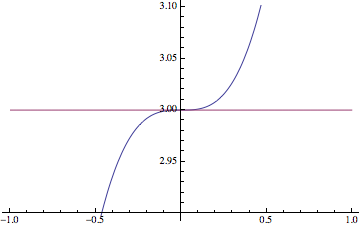
</figure>
</div>

Consider the graph of $y=x^3+3$, and the tangent line at $(0,3)$, which has slope zero and crosses the graph.


## 1.2. The derivative as a function

### Summary⭐

**📌Function and Graph**

In calculus, we often think of <u>the function</u> and <u>its graph</u> as being <u>**the same object**</u>. Therefore, we should think of the derivative of a function as a function as well.


### Example

Please take a look at the following example:

<div align="center">
    <figure>
        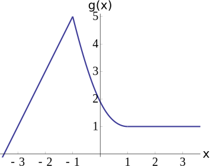
        <figcaption>function f(x)</figcaption>
</figure>
    <figure>
    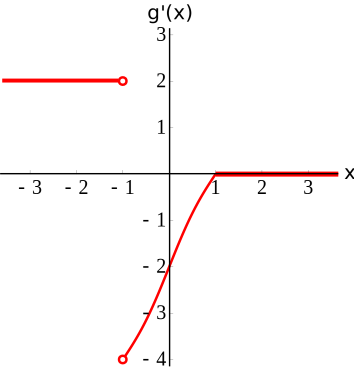
        <figcaption>the derivative function f'(x) of function f(x)</figcaption>
    </figure>
</div>


## 1.3. Calculating derivatives

### Summary⭐

**📌Delta Notation$\Delta$**

We change the notation from:
$$
f'(x)=\lim_{b\to x}\frac{f(b)-f(x)}{b-x}\\
$$
to:
$$
f'(x)=\lim_{\Delta x\to0}\frac{f(x+\Delta x)-f(x)}{\Delta x}\\
$$


**📌Derivatives and linearity**

> ​	The constant factor rule

If $g(x)=kf(x)$ for some constant $k$, then
$$
g'(x)=kf'(x)
$$
at all points where $f$ is differentiable.


> ​	The sum rule

If $h(x)=g(x)+f(x)$, then
$$
h'(x)=g'(x)+f'(x)
$$
at all points where $g$ and $f$ are differentiable.


> ​	The subtraction rule

If $h(x)=g(x)-f(x)$, then
$$
h'(x)=g'(x)-f'(x)
$$
at all points where $g$ and $f$ are differentiable.


**📌What is linearity?**

Respecting *addition*, *subtraction* and *constant multiplication* in the preceding definition is called “<u>**linearity**</u>," and it is an <u>important property of the derivative operation</u>!


**📌The Power Rule**

If $n$ is any fixed number, and
$$
f(x)=x^n
$$
then:
$$
f'(x)=nx^{n-1}
$$


**📌Derivatives of constant multiples proof**

Suppose that $g(x)=kf(x)$for all $x$, where $k$ is a constant. We want to prove that $g'(x)=kf'(x)$ at any point $x$ where $f$ is differentiable.
$$
\begin{align}
g'(x)&=\lim_{\Delta x\to0}\frac{g(x+\Delta x)-g(x)}{\Delta x}\\
&=\lim_{\Delta x\to0}\frac{kf(x+\Delta x)-kf(x)}{\Delta x}\\
&=\lim_{\Delta x\to0}k\frac{f(x+\Delta x)-f(x)}{\Delta x}\\
&=\Big(\lim_{\Delta x\to0}k\Big)\Big(\lim_{\Delta x\to0}\frac{f(x+\Delta x)-f(x)}{\Delta x}\Big)\\
&=kf'(x)
\end{align}
$$


### Example

**📌Example - Calculate the Derivative Function**

> ​	$f(x)=x^2$

$$
\begin{align}
f'(x)&=\lim_{b\to x}\frac{f(b)-f(x)}{b-x}\\
&=\lim_{b\to x}\frac{b^2-x^2}{b-x}\\
&=\lim_{b\to x}\frac{(b-x)(b+x)}{b-x}\\
&=\lim_{b\to x}\frac{\cancel{(b-x)}(b+x)}{\cancel{b-x}}\\
&\text{because b is approaching x}\\
&=x+x=2x
\end{align}
$$


> ​	$g(x)=mx+b$

$$
\begin{align}
g'(x)&=\lim_{c\to x}\frac{g(c)-g(x)}{c-x}\\
&=\frac{mc+b-(mx+b)}{c-x}\\
&=\frac{mc-mx}{c-x}\\
&=\frac{m(c-x)}{c-x}\\
&=\frac{m\cancel{(c-x)}}{\cancel{c-x}}\\&=m
\end{align}
$$


> ​	$h(x)=\frac{1}{x^2}$

$$
\begin{align}
h'(x)&=\lim_{\Delta x\to0}\frac{\frac{1}{(x+\Delta x)^2}-\frac{1}{x^2}}{\Delta x}\\
&=\lim_{\Delta x\to0}\frac{\frac{x^2}{(x+\Delta x)^2x^2}-\frac{(x+\Delta x)^2}{x^2(x+\Delta x)^2}}{\Delta x}\\
&=\lim_{\Delta x\to0}\frac{\frac{x^2-(x+\Delta x)^2}{(x+\Delta x)^2x^2}}{\Delta x}\\
&=\lim_{\Delta x\to0}\frac{x^2-(x+\Delta x)^2}{(x+\Delta x)^2x^2\Delta x}\\
&=\lim_{\Delta x\to0}\frac{x^2-(x^2+2x\Delta x+\Delta x^2)}{(x+\Delta x)^2x^2\Delta x}\\
&=\lim_{\Delta x\to0}\frac{-2x\Delta x-\Delta x^2}{(x+\Delta x)^2x^2\Delta x}\\
&=\lim_{\Delta x\to0}\frac{-2x\cancel{\Delta x}-\Delta x^{\cancel{2}}}{(x+\Delta x)^2x^2\cancel{\Delta x}}\\
&=\lim_{\Delta x\to0}\frac{-2x-\Delta x}{(x+\Delta x)^2x^2}\\
&=\lim_{\Delta x\to0}\frac{-2x-0}{(x+0)^2x^2}\\
&=\lim_{\Delta x\to0}\frac{-2x}{x^4}\\
&=\lim_{\Delta x\to0}-\frac{2}{x^3}\\
\end{align}
$$


**📌Example - Calculate the tangent line**

For the following function:
$$
f(x)=x^3-x
$$
Calculate the tangent line at the point $(2,f(2))=(2,6)$

<div align="center">
    <figure>
        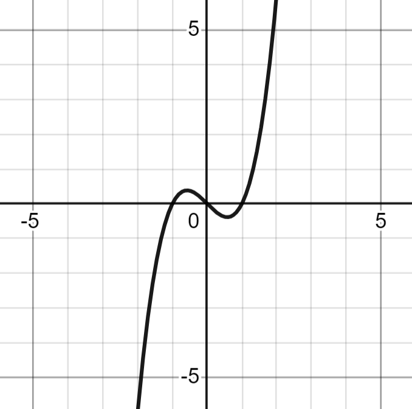
</figure>
</div>

To solve this, first we can calculate the derivative function first:
$$
\begin{align}
f'(x)&=(x^3-x)'\\
&=3x^2-1
\end{align}
$$
Therefore,
$$
f'(2)=11=\text{slope}
$$
Then the tangent line can be written as:
$$
y=11x+b
$$
If we plug $(2,6)$ in it, we can solve the tangent line as:
$$
y=11x-16
$$


## 1.4. Leibniz notation

### Summary⭐


**📌Why Leibniz notation?**

The biggest reason is that <u>it reminds us what the input variable is</u>. The derivative is measuring the instantaneous rate of change of the output variable of a function with respect to the input variable. Sometimes, if there are lots of quantities that have variables representing them, it's easy to lose track of what is what; Leibniz notation helps to remind us.


<div align="center">
    <figure>
    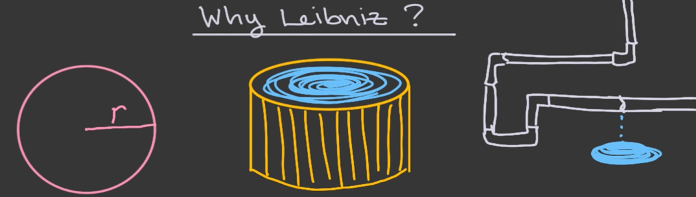
        <figcaption>Why Leibniz notation</figcaption>
    </figure>
</div>
Take the preceding diagram as example, from left to right, we are interested in:

- the relationship of <u>**area**</u> and <u>**radius**</u> as the radius grows
- the relationship of <u>**area**</u> and <u>**circumference**</u> as the hot tube[^2]
- the relationship of <u>**area**</u> and <u>**time**</u> as the water drops

If we write in Newton notation, we need to configure 3 different function and 3 different derivative function.
$$
A=f(r), \quad f'(r)\\
A=g(c), \quad g'(c)\\
A=h(t), \quad h'(t)\\
$$
However, if we write into Leibniz format:
$$
\begin{align}
\frac{dA}{dr}&,\text{ we know it respects to radius(r).}\\
\frac{dA}{dc}&,\text{ we know it respects to circumference(c).}\\
\frac{dA}{dt}&,\text{ we know it respects to time(t).}\\
\end{align}
$$


**📌Properties of Leibniz notation🌟**

There are few common properties of Leibniz notation.

> ​	**Units:**

If $P$ has units of pressure, and $t$ has units of <u>**time**</u>, then the following has units of pressure per time:
$$
\frac{dP}{dt}
$$


> ​	**Evaluating at points:**

If we want to take the derivative at a particular point $x=3$, then we use the following notation. The bar is read as “<u>**evaluated at**</u>".
$$
\frac{df}{dx}\Bigg|_{x=3}
$$


> ​	**Derivatives act on functions:**

We can write for the derivative of $x^2$ as:
$$
\frac{d(x^2)}{dx}
$$
If a formula is long, we can write:
$$
\frac{d}{dy}(y^3+2y^2)
$$


### Example

**📌Evaluate at certain point**

> ​	Q: What is $\frac{d}{dz}(z^3+2z^2)|_{z=2}?$

The derivative is:
$$
\frac{d}{dz}(z^3+2z^2)=3z^2+4z
$$
Therefore, when evaluate at $z=2$, the result is 20.


**📌Leibniz Notation**

> ​	Q: What does the letter $d$ in Leibniz's notation $\frac{df}{dx}$ stand for?

The letter $d$ stands for <u>**the limit of a difference**</u>. In particular, the quantity $\frac{df}{dx}$ is the limit of the difference quotient $\lim_{\Delta x\to0}\frac{\Delta f}{\Delta x}$.


**📌Circle Stuff**

> ​	Q: the area of a circle $A$ in terms of the radius $r$.

$$
A=\pi r^2
$$

> ​	Q: $\frac{dA}{dr}$?

$$
\frac{dA}{dr}=2\pi r
$$

> ​	Q: $\frac{dA}{dr}|_{r=3}$?

$$
\frac{dA}{dr}|_{r=3}=2\pi*3=6\pi
$$

> ​	Q: How to take derivative evaluate circumference rather than radius $\frac{dA}{dc}$?

First we write down the equation of $A$ with respect to $c$.
$$
\begin{align}
A&=\pi r^2\\
c&=2\pi r\\
c^2&=(2\pi r)^2\\
c^2&=(2\pi)^2r^2\\
c^2&=4\pi^2r^2\\
\frac{c^2}{4\pi}&=\pi r^2=A\\
\end{align}
$$
Therefore, we know the area $A$ with respect to $c$ is:
$$
A = \frac{c^2}{4\pi}\\
$$
Hence, the derivative with respect to $c$ is:
$$
\frac{dA}{dc}=\frac{c}{2\pi}
$$


> ​	Q: Evaluate at $c=6\pi$

$$
\frac{dA}{dc}\Bigg|_{c=6\pi}=\frac{c}{2\pi}=\frac{6\pi}{2\pi}=3
$$


## 1.5. Second derivatives and higher

### Summary⭐

**📌Second derivative**

The second derivative of a function $f(x)$ is the first derivative of $f'(x)$, and is denoted by:
$$
f''(x)\text{ or }\frac{d^2f}{dx^2}
$$


**📌Higher derivatives**

The $n$th derivative of a function $f(x)$ is the first derivative of $f^{(n-1)}(x)$, and is denoted by:
$$
f^{(n)}(x)\text{ or }\frac{d^nf}{dx^n}
$$


**📌Second derivative and concavity summary**

On intervals where $f''>0$, the function $f$ is concave up.

<div align="center">
    <figure>
    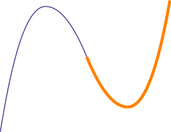
        <figcaption>concave up</figcaption>
    </figure>
</div>

On intervals where $f''<0$, the function $f$ is concave down.

<div align="center">
    <figure>
    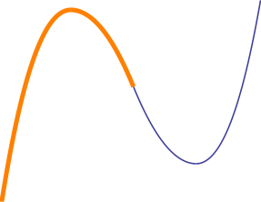
        <figcaption>concave down</figcaption>
    </figure>
</div>

Points where the graph of a function changes from concave up to concave down, or vice versa, are called **inflection points**.


**📌Position, velocity, acceleration**

If $x(t)$ is a function that describes position as a function of time, then:

- $x'(t)$ is the <u>**velocity**</u>
- $x''(t)$ is the <u>**acceleration**</u>


### Example

**📌Example - Sign of each functions**

<div align="center">
    <figure>
    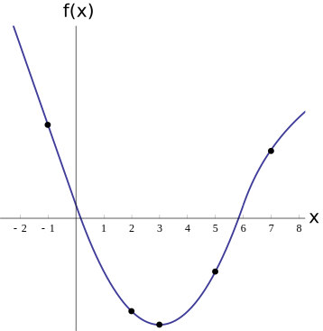
    </figure>
</div>

$$
\begin{align}
f'(-1)&=\text{negative}\\
f''(-1)&=\text{zero}\\
f'(2)&=\text{negative}\\
f''(2)&=\text{positive}\\
f'(3)&=\text{zero}\\
f''(3)&=\text{positive}\\
f'(5)&=\text{positive}\\
f''(5)&=\text{positive}\\
f'(7)&=\text{positive}\\
f''(7)&=\text{negative}\\
\end{align}
$$


**📌Example - Real world meaning**

> ​	Q: What does it mean "Rate of job growth slows"? Let's elaborate in math.

$$
\underbrace{\text{Rate of job }}_{}\underbrace{\text{growth}}_{f'>0}\underbrace{\text{ slow}}_{f''<0}
$$

Therefore, we could have the following

> ​	A: $+200,000$ jobs/month in first quarter, $+100,000$ jobs/month in second quarter.


> ​	Q: What does it mean “Rate of population loss in Capitol City eases"?

$$
\underbrace{\text{Rate of population }}_{}\underbrace{\text{loss}}_{f'<0}\text{in Capitol City }\underbrace{\text{ eases}}_{f''>0}
$$


## 1.6. Trigonometric functions: sine and cosine

### Summary⭐

**📌Derivative of sine and cosine**

The derivative of of the trig functions are:
$$
\begin{align}
\frac{d}{dx}\sin(x)&=\cos(x)\\
\frac{d}{dx}\cos(x)&=-\sin(x)\\
\frac{d^2}{dx^2}\sin(x)&=-\sin(x)\\
\frac{d^2}{dx^2}\cos(x)&=-\cos(x)\\
\end{align}
$$


**📌Definition of significant figures**

The number of *significant figures* is the count of those digits that carry meaning with regards to precision.


### Example

**📌Example - Significant Figures**

> ​	The "is"✔

- All non-zero digits are significant: `1235` has 4 significant digits.
- Zeros appearing between nonzero digits are significant: `101` has 3 significant digits.
- Trailing zeros in a number containing a decimal are significant: `32.000` has 5 significant figures.

> ​	The "is not"❌

- Trailing zeros in a number with no decimal are *not* significant: `5400` has 2 significant figures.
- Leading zeros in a decimal number are not significant: `0.0003` has 1 significant figure.
- Extraneous digits introduced in a computation to greater precision than measured data are *not* significant: if `.25` and `.50` are measurements accurate to `.01`, then in the product `(.25)(.50) = 0.125` the last 5 is *not* significant.


### Misc

**📌Derivative of Sine Proof**

We use this formula:
$$
\sin(a\pm b)=\sin(a)\cos(b)\pm\cos(a)\sin(b)
$$
The derivative of $\sin(x)$:
$$
\begin{align}
\frac{d}{dx}\sin(x)&=\lim_{\Delta x\to0}\frac{f(\Delta x+x)-f(x)}{\Delta x}\\
&=\lim_{\Delta x\to0}\frac{\sin(\Delta x+x)-\sin(x)}{\Delta x}\\
&=\lim_{\Delta x\to0}\frac{\sin(x)\cos(\Delta x)+\cos(x)\sin(\Delta x)-\sin(x)}{\Delta x}\\
&=\lim_{\Delta x\to0}\frac{[\sin(x)\cos(\Delta x)-\sin(x)]+\cos(x)\sin(\Delta x)}{\Delta x}\\
&=\lim_{\Delta x\to0}\Bigg(\sin(x)\frac{\cos(\Delta x)-1}{\Delta x}+\cos(x)\frac{\sin(\Delta x)}{\Delta x}\Bigg)\\
\end{align}
$$
Therefore, when $x=0$, it becomes:
$$
\begin{align}
\frac{d\sin(x)}{dx}\Bigg|_{x=0}&=\sin(0)\frac{\cos(\Delta x)-1}{\Delta x}+\cos(0)\frac{\sin(\Delta x)}{\Delta x}\\
&=\frac{\sin(\Delta x)}{\Delta x}
\end{align}
$$
This can also apply to $\cos()$:
$$
\frac{d\cos(x)}{dx}\Bigg|_{x=0}=\frac{\cos(\Delta x)-1}{\Delta x}
$$


**📌Geometric Proof of Derivative of sine at 0**

OK, now we know when $x=0$ we can write down the following formula:
$$
\begin{align}
\frac{d\sin(x)}{dx}\Bigg|_{x=0}&=\frac{\sin(\Delta x)}{\Delta x}
\end{align}
$$
However, the numerator and denominator are both zero. The MIT provided an excellent example to prove it.

<div align="center">
    <figure>
    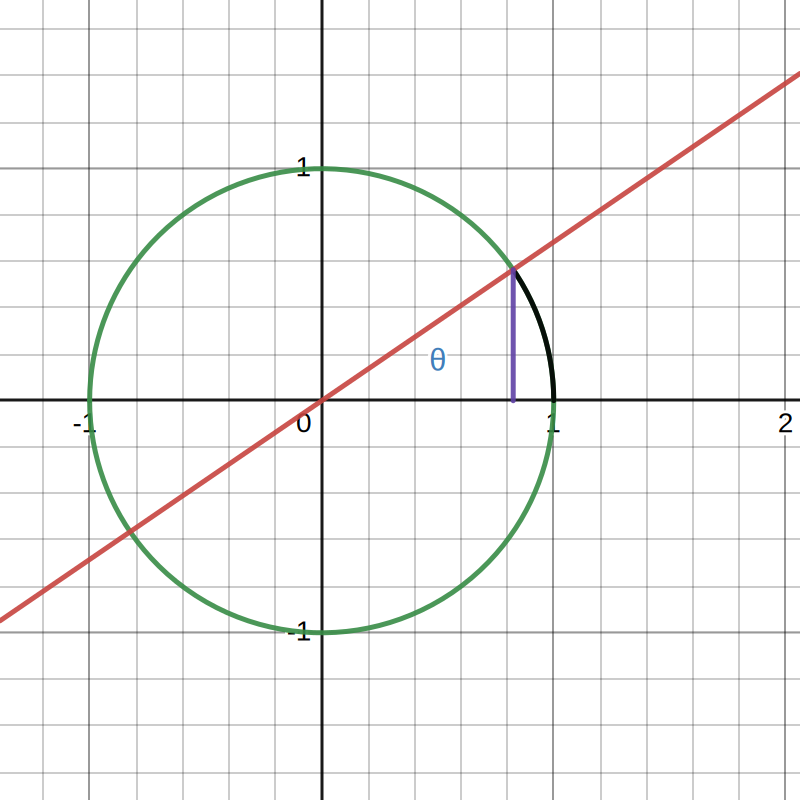
    </figure>
</div>
Let me briefly introduce the elements above:

<div align="center">
<p style="color:Green">A unit circle with r=1</p>
<p style="color:Red">A secant line with</p>
<p style="color:blue">Theta angle</p>
<p style="color:Black">Arc length</p>
<p style="color:Purple">The height</p>
    </div>

We are interested in:

- the arc length
- the height

$$
\begin{align}
\text{the circumference of the circle }&=2\pi r=2\pi\cross1=2\pi\\
\text{the arc length of angle }\theta&=2\pi\cross\frac{\theta}{2\pi}=\theta\\
\text{the height}&=r\cross \sin(\theta)=\sin(\theta)
\end{align}
$$

And we have:
$$
\begin{align}
\frac{d\sin(x)}{dx}\Bigg|_{x=0}&=\frac{\sin(\Delta x)}{\Delta x}
\end{align}
$$
Therefore we can see it as:
$$
\lim_{\theta\to0}\frac{\sin(\theta)}{\theta}
$$
The geometrical meaning can be like this:

<div align="center">
    <figure>
    <div></div>
    <div>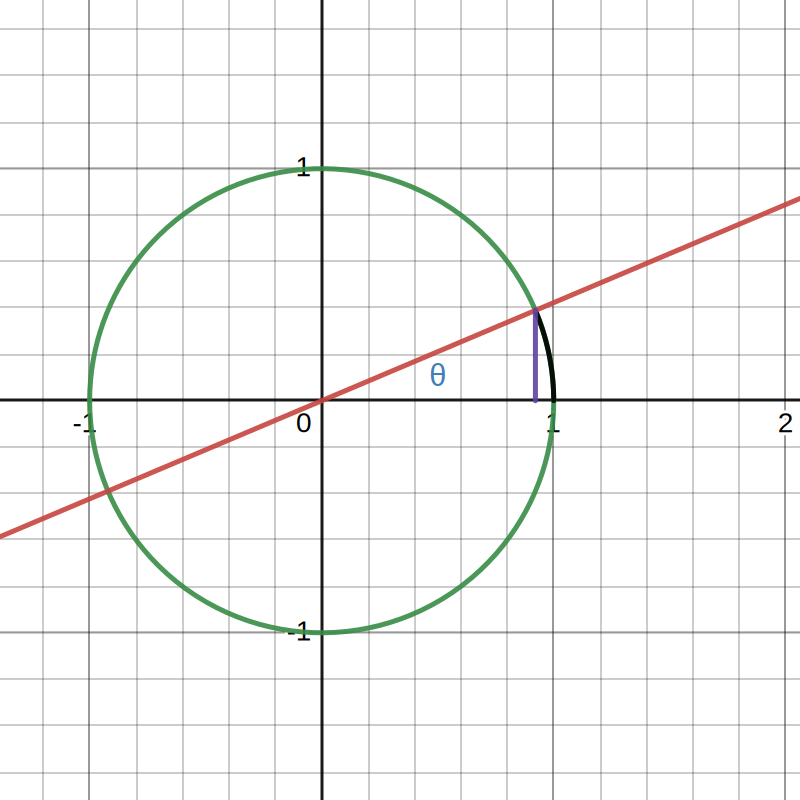</div>
    <div>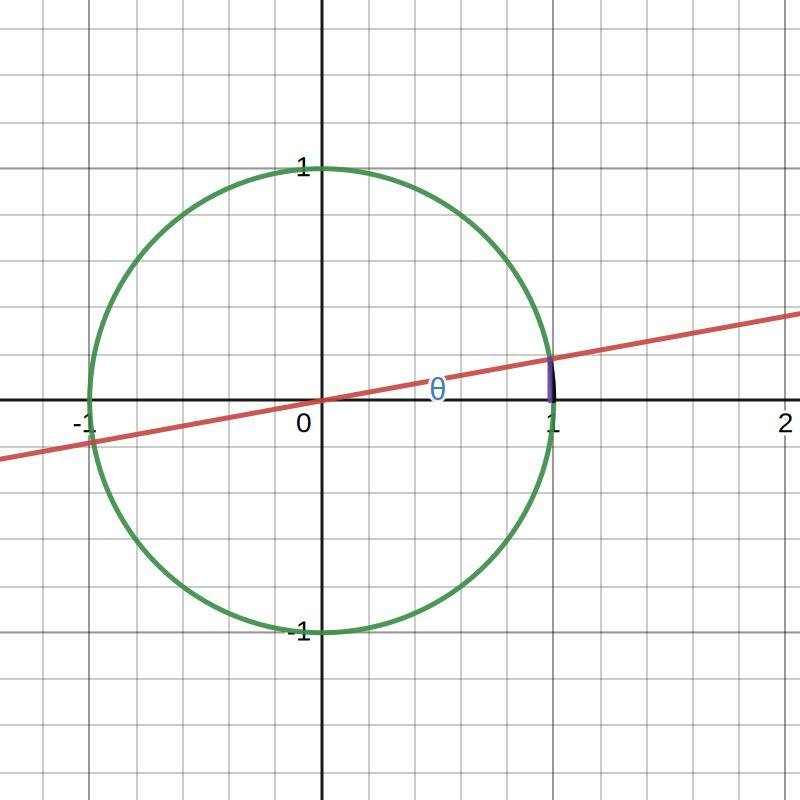</div>
    <div></div>
    </figure>
</div>
Therefore, when $\theta$ getting smaller, the are equal!!
$$
\begin{align}
\frac{d\sin(x)}{dx}\Bigg|_{x=0}&=\frac{\sin(\Delta x)}{\Delta x}=1
\end{align}
$$
⚠It only applies to when the $\theta$ is measured in radians.


**📌Geometric Proof of Derivative of cosine at 0**
$$
\frac{d\cos(x)}{dx}\Bigg|_{x=0}=\frac{\cos(\Delta x)-1}{\Delta x}
$$
We can see that:

<div align="center">
    <figure>
    <div></div>
    <div>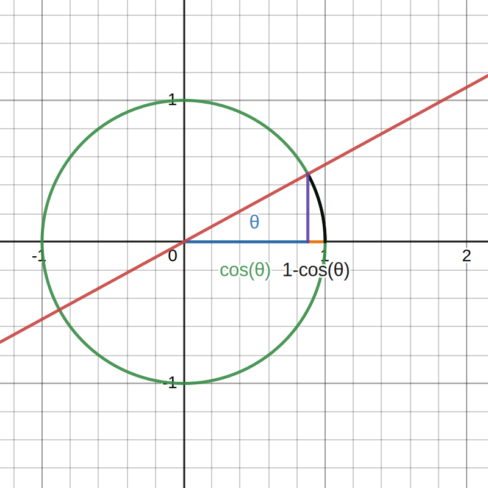</div>
    <div>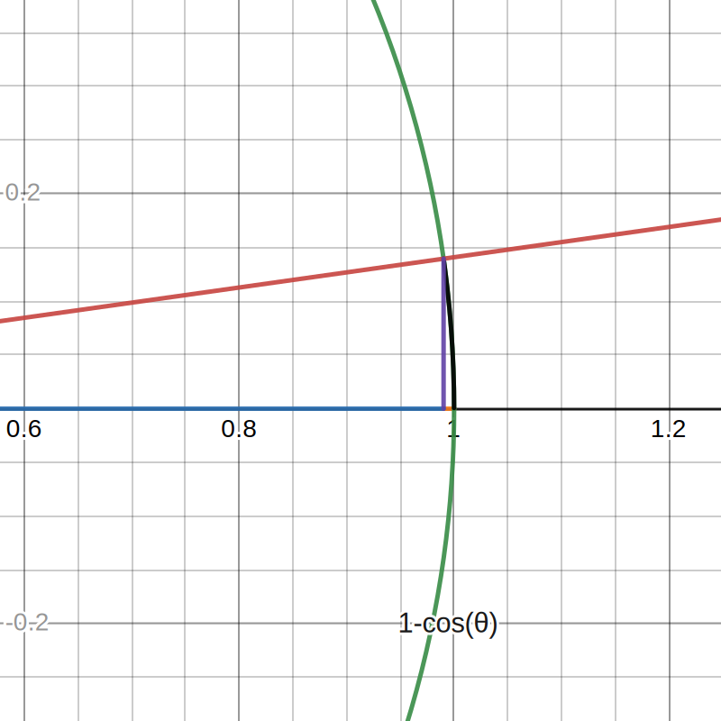</div>
    </figure>
</div>

The $1-\cos(\theta)$ is shrinking much faster than $\theta$!! Therefore:
$$
\frac{d\cos(x)}{dx}\Bigg|_{x=0}=\frac{\cos(\Delta x)-1}{\Delta x}=0
$$


## 1.7. Homework

**📌Quiz**

> ​	Q: What is the following limit?

$$
L=\lim_{x\to1}\frac{x^{-7/4}-1}{x-1}
$$

> ​	Solution 1 [<u>**L'Hôpital's rule**</u>](https://en.wikipedia.org/wiki/L'H%C3%B4pital's_rule):

This solution is provided by Zebin. The L'Hôpital's rule states that:

 if
$$
\lim _{x\to c}f(x)=\lim _{x\to c}g(x)=0{\text{ or }}\pm \infty
$$
and
$$
 g'(x)\neq 0\text{, for all }x\text{ in}
$$
and
$$
\lim _{x\to c}{\frac {f'(x)}{g'(x)}}\text{ exists}
$$
then
$$
\lim _{x\to c}{\frac {f(x)}{g(x)}}=\lim _{x\to c}{\frac {f'(x)}{g'(x)}}
$$


Since
$$
\text{when }x=1,\frac{x^{-7/4}-1=0}{x-1=0}
$$
Therefore, we can have:
$$
L=\lim_{x\to1}\frac{x^{-7/4}-1}{x-1}=\lim_{x\to1}\frac{(x^{-7/4}-1)'}{(x-1)'}=-\frac{7}{4}
$$


> ​	Solution 2(by mit)

Let $f(x)=x^{-7/4}$. Then this limit is $\lim_{x\to1}\frac{f(x)-1}{x-1}=f'(1)$. Now we compute the derivative of $f(x)$ directly rather than attempting to evaluate this limit: $f'(x)=-7/4x^{-11/4}$ , and $f'(1)=-7/4$. 


# 2.Differentiation

## 2.1. Linear Approximation

### Summary⭐

**📌Linear approximation**

The linear approximation for a function $f$ near a point $x=a$ is given by the following equivalent formulas:
$$
\Delta f\approx\frac{df}{dx}\bigg|_{x=a}\cdot\Delta x\quad\text{for }\Delta x\text{ near 0}\\
f(x)\approx f'(a)(x-a)+f(a)\quad\text{for }x \text{ near }a
$$


### Example

**📌Linear Approximation Easy Example**

Given a function:
$$
g(x)=\sqrt{x}
$$
What is the value of $g(104)$? Use linear approximation rather than calculator to do this.

Because 104 is near 100, so we can set $a=100$.
$$
g'(x)=\frac{1}{2\sqrt{x}}
$$
Then we know the slope at $x=100$:
$$
g'(100)=\frac{1}{20}=0.05
$$
And also we know the value at $x=100$ is:
$$
g(100)=\sqrt{100}=10
$$
So we can draw the diagram:

<div align="center">
    <figure>
    <div>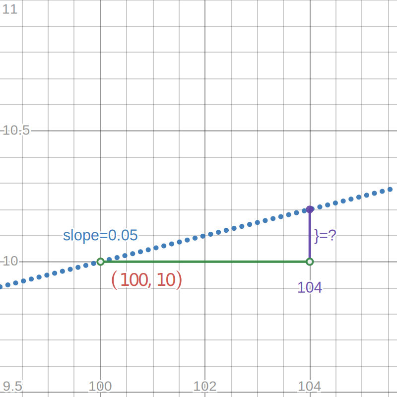</div>
    </figure>
</div>

From $x=100$ to $x=104$, the difference can be "**approximated**" as the $?$ on the purple line. Imagine the $(100, 10)$ as the origin, then the height of purple line is:
$$
0.05\cross(104-100) = 0.2 = \Delta g(x)
$$
Therefore, 
$$
\begin{align}
g(104) &\approx g(100)+\Delta g(104-100)\\
&=10+0.2=10.2
\end{align}
$$


## 2.2. Product Rule

### Summary⭐

**📌Product Rule**

If
$$
h(x)=f(x)g(x)
$$
 then
$$
h'(x)=f(x)g'(x)+g(x)f'(x)
$$
at all points where the derivatives $f'(x)$ and $g'(x)$ are defined.


### Example

**📌Proof**

For
$$
h(t)=f(t)g(t)
$$
I am gonna prove that
$$
h'(t)\neq f'(t)g'(t)
$$

> ​	Solution 1: by the unit

Suppose that $t$ is variable measuring time in seconds $s$, and $f$ and $g$ are functions of that output distances, measured in meters $m$.

The unit of $f(t), g(t)$ is:
$$
m
$$
The unit of $f'(t), g'(t)$ is:
$$
m/s
$$
The unit of $f'(t),g'(t)$ is:
$$
m^2/s^2
$$
The unit of $h(t)$ is:
$$
m^2
$$
The unit of $h'(t)$ is
$$
m^2/s\\
$$
Therefore,
$$
\begin{align}
m^2/s &\neq m^2/s^2\\
h'(t) &\neq f'(t)g'(t)
\end{align}
$$

> ​	Solution 2: by geometry

<div align="center">
    <figure>
    <div>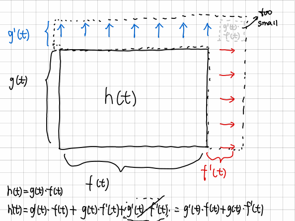</div>
    </figure>
</div>

The $h(t)$ is the area of the rectangle and $h'(t)$ is the rate of growth of that rectangle(area in dot). Therefore, we can have:
$$
h'(t)=f(t)g'(t)+g(t)f'(t)
$$


**📌Example**

Find the derivative of $j(x)=\sqrt{x}\cos{x}$.

Set
$$
\begin{align}
f(x)&=\sqrt{x}\\g(x)&=\cos{x}\\
j(x)&=f'(x)g(x)+f(x)g'(x)\\
&=\frac{1}{2\sqrt{x}}\cos{x}-\sin{x}\sqrt{x}
\end{align}
$$


## 2.3. Quotient Rule

### Summary⭐

**📌Quotient Rule**

If
$$
h(x)=\frac{f(x)}{g(x)} \quad \text{for all }x
$$
then
$$
h'(x)=\frac{f'(x)g(x)-f(x)g'(x)}{g(x)^2}
$$
at all points where $f(x)$ and $g(x)$ are differentiable and $g(x)\neq 0$.


### Example

**📌Proof**

You can prove it using $\Delta h$.

For:
$$
h(x) = \frac{f(x)}{g(x)}
$$
Have:
$$
\begin{align}
h'(x)&=\lim_{\Delta x\to0}\frac{h(x+\Delta x)-h(x)}{\Delta x}\\
&=\bigg(\frac{f(x+\Delta x)}{g(x+\Delta x)}-\frac{f(x)}{g(x)}\bigg)/\Delta x\\
&=\bigg(\frac{ \frac{f(x+\Delta x)\cdot g(x)-f(x)\cdot g(x+\Delta x)}{\Delta x}  }{g(x+\Delta x)\cdot g(x)}\bigg)\\
&=\text{continue..}
\end{align}
$$


**📌The derivative of $\tan{}$ **
$$
\begin{align}
\frac{d}{dx}(\tan{x})&=\frac{d}{dx}(\frac{\sin{x}}{\cos{x}})\\
&=\frac{(\sin{x})'\cos{x}-\sin{x}(\cos{x})'}{(\cos x)^2}\\
&=\frac{(\cos{x})^2+(\sin{x})^2}{(\cos{x})^2}\\
&=\frac{1}{(\cos{x})^2}=(\sec^{x})^2
\end{align}
$$


## 2.4. Chain rule

### Summary⭐

**📌Chain Rule**

If
$$
h(x)=f(g(x))
$$
then
$$
\begin{align}
h'(x)=f'(g(x))\cdot g'(x)
\end{align}
$$
at all points where the derivatives $f'(g(x))$ and $g'(x)$ are defined.

Alternatively, we can see this in Leibniz format. If
$$
y=f(u), u=g(x)
$$
then
$$
\frac{dy}{dx}\bigg|_{x=a}=\frac{dy}{du}\bigg|_{u=g(a)}\frac{du}{dx}\bigg|_{x=a}
$$


at any point $x=a$ where the derivatives on the right hand side are defined.


### Example

**📌Example of Chain Rule**

Calculate the derivative of
$$
\frac{d}{d\theta}(\cos^2(\theta^4))
$$
The chain rule can much easier be solved by the Leibniz notation:


Let
$$
y=\cos^2(\theta^4)
$$
Then 
$$
\frac{d}{d\theta}(\cos^2(\theta^4))
$$
can be decomposed as:
$$
\begin{align}
y&=x^2\\
x&=\cos{w}\\
w&=\theta^4
\end{align}
$$
Then we have:
$$
\begin{align}
\frac{d}{d\theta}(\cos^2(\theta^4))&=\frac{dy}{dx}\cdot\frac{dx}{dw}\cdot\frac{dw}{d\theta}\\
&=2x\cdot(-\sin{w})\cdot4\theta^3\\
\text{plug y..x..w..}\\
&=2\cos{\theta^4}\cdot(-\sin{\theta^4})\cdot4\theta^3
\end{align}
$$


## 2.5. Implicit functions

### Summary⭐

**📌Definition of Implicit function**

An **implicit function** is an equation involving both $x$ and $y$ (or any two variables really); you *could* solve for $y$ as a function of $x$, but often times, that computation is messy (or impossible). 


**📌Definition of Explicit function**

If a function is not implicit, we say that it is explicit.


**📌Why do we need implicit function?**

Immediately differentiating
$$
y=x^{m/n}
$$
is hard. But differentiating the *implicit* function
$$
y^n=x^m
$$
was a whole lot easier. This happens any time your function is more simply described implicitly.


### Example

**📌Example**

//TODO - here should be an example of the geometry curve

// hint-my idea-the y can be see as the composition of x function

//TODO - the example of recitation

<div align="center">
    <h1>
        Integration
    </h1>
</div>


<div align="center">
    <h1>
        Coordinate Systems & Infinite Series
    </h1>
</div>


[^1]: 一元一次方程

[^2]: 管子外面的一层层包裹起来，圆形面积也会grow起来。circumference是周长的意思。
[^3]: 洛必达法则

