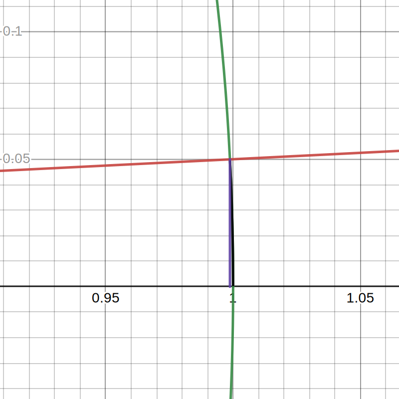

# 0.Limits

## 0.3. Homework

**📌Quiz**

The root $a$ of a polynomial $p(x)$ has multiplicity $m$ if $(x-a)^m$ is the largest power of $x-a$ that is a factor of $p$. In other words, , $p(x)=(x-a)^ms(x)$where $s(x)$ is a polynomial for which $a$ is not a root.

> ​	Description: The numerator and denominator <u>**can't not be canceled**</u> since the <u>root is different</u>!!

Q1️⃣: If $a$ is a root of multiplicity 5 for the polynomial $p$, and a root of multiplicity 7 for the polynomial $q$, what might be $\lim_{x\to a}\frac{p(x)}{q(x)}$? 

- [ ] 0
- [ ] 1
- [ ] -1
- [ ] 3
- [x] It does not exist

> ​	Explain: The denominator wins in the race to 0 so the limit is not defined.

Q2️⃣: If $a$ is a root of multiplicity 8 for the polynomial $p$, and a root of multiplicity 4 for the polynomial $q$, what might be $\lim_{x\to a}\frac{p(x)}{q(x)}$? 

- [x] 0
- [ ] 1
- [ ] -1
- [ ] 3
- [ ] It does not exist

> ​	Explain: The numerator wins the race to 0, so the limit is 0.

Q3️⃣: If $a$ is a root of multiplicity 6 for the polynomial $p$, and a root of multiplicity 6 for the polynomial $q$, what might be $\lim_{x\to a}\frac{p(x)}{q(x)}$? 

- [ ] 0
- [x] 1
- [x] -1
- [x] 3
- [ ] It does not exist

> ​	Explain: Both numerator and denominator are competing in the race towards zero, so the limit could be any finite, nonzero number!

# 1.Derivative

## 1.1. Geometric interpretation of the derivative

### Example

**📌Example on Limits, Continuous, and Differentiable**

Let's look at the $x=0$ of the following function $f(x)=\abs{x}$:

    <figure>
        
        <figcaption>Absolute function</figcaption>
</figure>

> ​	Limits✔:

The <u>left-hand limit</u> and <u>right-hand limit</u> are the same. Therefore the limit at $x=0$ exist.
$$
\begin{align}
\lim_{x\to0^-}\abs{x}=0\\
\lim_{x\to0^+}\abs{x}=0\\
\lim_{x\to0}\abs{x}=0\\
\end{align}
$$

> ​	Continuous✔:

Since
$$
\lim_{x\to0^-}\abs{x}=0=\lim_{x\to0^+}\abs{x}=f(x)=0
$$
Therefore the function is continuous.

> ​	Differentiable❌:

It is not differentiable at $x=0$, because
$$
\begin{align}
\lim_{x\to0^-}\frac{\abs{x}-0}{x-0}&=-1\\
\lim_{x\to0^+}\frac{\abs{x}-0}{x-0}&=1\\
\end{align}
$$
We have a name of the preceding derivative:

- <u>**left-sided derivative**</u>, denoted as $f'(0^-)=\lim_{x\to0^-}\frac{f(x)-f(x)}{x-0}$
- <u>**right-sided derivative**</u>, denoted as $f'(0^+)=\lim_{x\to0^+}\frac{f(x)-f(x)}{x-0}$

**📌Example - Derivative of a Jump Discontinuity Function**

Take a look at the following function:

    <figure>
        
        <figcaption>Jump Discontinuity Function</figcaption>
</figure>

The <u>**right-sided derivative**</u> is easy, which is:
$$
f'(0^+)=1
$$
However, we sometime may make mistake on the <u>**left-sided derivative**</u>:
$$
f'(0^-)=\infin
$$
It is infinity rather 0!! Why? Please recall how to calculate the derivative - some value close to $x=0$ and $x=-0.001$, that line is <u>**hell vertical line**</u>😲😲! The similar function is the following:
$$
f(x) = \sqrt[3]{x}
$$

    <figure>
        
        <figcaption>Vertical tangent line at x=0</figcaption>
</figure>

Therefore it is not differentiable at $x=0$.

**📌Example on Derivative**

    <figure>
        
</figure>

The following are the derivatives:
$$
\begin{align}
f'(-1)&=DNE\\
f'(0)&=0\\
f'(1)&=DNE\\
f'(2)&=DNE\\
f'(3)&=1/3\\
\end{align}
$$

### Misc

**📌Interpretation of Linear Equation[^1]**

If I recall the derivative in my college, I remember that the derivative of a linear function is a constant. Before this class, I only 死记硬背 this rule. But now I can see in the geometrical perspective.

    <figure>
        
        <figcaption>Linear equation</figcaption>
</figure>

Because <u>**the slope is always the same**</u> no matter what $x$ is, therefore the derivative of <u>a linear equation is a constant</u>.

**📌Review Questions**

> Q: If it exists, the derivative of a function at a point is a:

- [ ] Line
- [x] Number
- [ ] Point
- [ ] Function

The derivative at a point is related to the tangent line at that point, but <u>**it is not the line itself**</u> - it is **the line's slope**. That's a number.

> ​	Q: True or false: A tangent line to the graph of $f$ at $(a,f(a))$ can cross the graph of $f$ at that point.

True.

    <figure>
        
</figure>

Consider the graph of $y=x^3+3$, and the tangent line at $(0,3)$, which has slope zero and crosses the graph.

## 1.2. The derivative as a function

### Summary⭐

**📌Function and Graph**

In calculus, we often think of <u>the function</u> and <u>its graph</u> as being <u>**the same object**</u>. Therefore, we should think of the derivative of a function as a function as well.

### Example

Please take a look at the following example:

    <figure>
        
        <figcaption>function f(x)</figcaption>
</figure>
    <figure>
    
        <figcaption>the derivative function f'(x) of function f(x)</figcaption>
    </figure>

## 1.3. Calculating derivatives

### Summary⭐

**📌Derivatives and linearity**

> ​	The constant factor rule

If $g(x)=kf(x)$ for some constant $k$, then
$$
g'(x)=kf'(x)
$$
at all points where $f$ is differentiable.

> ​	The sum rule

If $h(x)=g(x)+f(x)$, then
$$
h'(x)=g'(x)+f'(x)
$$
at all points where $g$ and $f$ are differentiable.

> ​	The subtraction rule

If $h(x)=g(x)-f(x)$, then
$$
h'(x)=g'(x)-f'(x)
$$
at all points where $g$ and $f$ are differentiable.

**📌What is linearity?**

Respecting *addition*, *subtraction* and *constant multiplication* in the preceding definition is called “<u>**linearity**</u>," and it is an <u>important property of the derivative operation</u>!

**📌The Power Rule**

If $n$ is any fixed number, and
$$
f(x)=x^n
$$
then:
$$
f'(x)=nx^{n-1}
$$

**📌Derivatives of constant multiples proof**

Suppose that $g(x)=kf(x)$for all $x$, where $k$ is a constant. We want to prove that $g'(x)=kf'(x)$ at any point $x$ where $f$ is differentiable.
$$
\begin{align}
g'(x)&=\lim_{\Delta x\to0}\frac{g(x+\Delta x)-g(x)}{\Delta x}\\
&=\lim_{\Delta x\to0}\frac{kf(x+\Delta x)-kf(x)}{\Delta x}\\
&=\lim_{\Delta x\to0}k\frac{f(x+\Delta x)-f(x)}{\Delta x}\\
&=\Big(\lim_{\Delta x\to0}k\Big)\Big(\lim_{\Delta x\to0}\frac{f(x+\Delta x)-f(x)}{\Delta x}\Big)\\
&=kf'(x)
\end{align}
$$

### Example

**📌Example - Calculate the Derivative Function**

> ​	$f(x)=x^2$

$$
\begin{align}
f'(x)&=\lim_{b\to x}\frac{f(b)-f(x)}{b-x}\\
&=\lim_{b\to x}\frac{b^2-x^2}{b-x}\\
&=\lim_{b\to x}\frac{(b-x)(b+x)}{b-x}\\
&=\lim_{b\to x}\frac{\cancel{(b-x)}(b+x)}{\cancel{b-x}}\\
&\text{because b is approaching x}\\
&=x+x=2x
\end{align}
$$

> ​	$g(x)=mx+b$

$$
\begin{align}
g'(x)&=\lim_{c\to x}\frac{g(c)-g(x)}{c-x}\\
&=\frac{mc+b-(mx+b)}{c-x}\\
&=\frac{mc-mx}{c-x}\\
&=\frac{m(c-x)}{c-x}\\
&=\frac{m\cancel{(c-x)}}{\cancel{c-x}}\\&=m
\end{align}
$$

> ​	$h(x)=\frac{1}{x^2}$

$$
\begin{align}
h'(x)&=\lim_{\Delta x\to0}\frac{\frac{1}{(x+\Delta x)^2}-\frac{1}{x^2}}{\Delta x}\\
&=\lim_{\Delta x\to0}\frac{\frac{x^2}{(x+\Delta x)^2x^2}-\frac{(x+\Delta x)^2}{x^2(x+\Delta x)^2}}{\Delta x}\\
&=\lim_{\Delta x\to0}\frac{\frac{x^2-(x+\Delta x)^2}{(x+\Delta x)^2x^2}}{\Delta x}\\
&=\lim_{\Delta x\to0}\frac{x^2-(x+\Delta x)^2}{(x+\Delta x)^2x^2\Delta x}\\
&=\lim_{\Delta x\to0}\frac{x^2-(x^2+2x\Delta x+\Delta x^2)}{(x+\Delta x)^2x^2\Delta x}\\
&=\lim_{\Delta x\to0}\frac{-2x\Delta x-\Delta x^2}{(x+\Delta x)^2x^2\Delta x}\\
&=\lim_{\Delta x\to0}\frac{-2x\cancel{\Delta x}-\Delta x^{\cancel{2}}}{(x+\Delta x)^2x^2\cancel{\Delta x}}\\
&=\lim_{\Delta x\to0}\frac{-2x-\Delta x}{(x+\Delta x)^2x^2}\\
&=\lim_{\Delta x\to0}\frac{-2x-0}{(x+0)^2x^2}\\
&=\lim_{\Delta x\to0}\frac{-2x}{x^4}\\
&=\lim_{\Delta x\to0}-\frac{2}{x^3}\\
\end{align}
$$

**📌Example - Calculate the tangent line**

For the following function:
$$
f(x)=x^3-x
$$
Calculate the tangent line at the point $(2,f(2))=(2,6)$

    <figure>
        
</figure>

To solve this, first we can calculate the derivative function first:
$$
\begin{align}
f'(x)&=(x^3-x)'\\
&=3x^2-1
\end{align}
$$
Therefore,
$$
f'(2)=11=\text{slope}
$$
Then the tangent line can be written as:
$$
y=11x+b
$$
If we plug $(2,6)$ in it, we can solve the tangent line as:
$$
y=11x-16
$$

## 1.4. Leibniz notation

### Summary⭐

**📌Why Leibniz notation?**

    <figure>
    
        <figcaption>Why Leibniz notation</figcaption>
    </figure>

Take the preceding diagram as example, from left to right, we are interested in:

- the relationship of <u>**area**</u> and <u>**radius**</u> as the radius grows
- the relationship of <u>**area**</u> and <u>**circumference**</u> as the hot tube[^2]
- the relationship of <u>**area**</u> and <u>**time**</u> as the water drops

If we write in Newton notation, we need to configure 3 different function and 3 different derivative function.
$$
A=f(r), \quad f'(r)\\
A=g(c), \quad g'(c)\\
A=h(t), \quad h'(t)\\
$$
However, if we write into Leibniz format:
$$
\begin{align}
\frac{dA}{dr}&,\text{ we know it respects to radius(r).}\\
\frac{dA}{dc}&,\text{ we know it respects to circumference(c).}\\
\frac{dA}{dt}&,\text{ we know it respects to time(t).}\\
\end{align}
$$

### Example

**📌Evaluate at certain point**

> ​	Q: What is $\frac{d}{dz}(z^3+2z^2)|_{z=2}?$

The derivative is:
$$
\frac{d}{dz}(z^3+2z^2)=3z^2+4z
$$
Therefore, when evaluate at $z=2$, the result is 20.

**📌Leibniz Notation**

> ​	Q: What does the letter $d$ in Leibniz's notation $\frac{df}{dx}$ stand for?

The letter $d$ stands for <u>**the limit of a difference**</u>. In particular, the quantity $\frac{df}{dx}$ is the limit of the difference quotient $\lim_{\Delta x\to0}\frac{\Delta f}{\Delta x}$.

**📌Circle Stuff**

> ​	Q: the area of a circle $A$ in terms of the radius $r$.

$$
A=\pi r^2
$$

> ​	Q: $\frac{dA}{dr}$?

$$
\frac{dA}{dr}=2\pi r
$$

> ​	Q: $\frac{dA}{dr}|_{r=3}$?

$$
\frac{dA}{dr}|_{r=3}=2\pi*3=6\pi
$$

> ​	Q: How to take derivative evaluate circumference rather than radius $\frac{dA}{dc}$?

First we write down the equation of $A$ with respect to $c$.
$$
\begin{align}
A&=\pi r^2\\
c&=2\pi r\\
c^2&=(2\pi r)^2\\
c^2&=(2\pi)^2r^2\\
c^2&=4\pi^2r^2\\
\frac{c^2}{4\pi}&=\pi r^2=A\\
\end{align}
$$
Therefore, we know the area $A$ with respect to $c$ is:
$$
A = \frac{c^2}{4\pi}\\
$$
Hence, the derivative with respect to $c$ is:
$$
\frac{dA}{dc}=\frac{c}{2\pi}
$$

> ​	Q: Evaluate at $c=6\pi$

$$
\frac{dA}{dc}\Bigg|_{c=6\pi}=\frac{c}{2\pi}=\frac{6\pi}{2\pi}=3
$$

## 1.5. Second derivatives and higher

### Summary⭐

**📌Second derivative**

The second derivative of a function $f(x)$ is the first derivative of $f'(x)$, and is denoted by:
$$
f''(x)\text{ or }\frac{d^2f}{dx^2}
$$

**📌Higher derivatives**

The $n$th derivative of a function $f(x)$ is the first derivative of $f^{(n-1)}(x)$, and is denoted by:
$$
f^{(n)}(x)\text{ or }\frac{d^nf}{dx^n}
$$

**📌Second derivative and concavity summary**

On intervals where $f''>0$, the function $f$ is concave up.

    <figure>
    
        <figcaption>concave up</figcaption>
    </figure>

On intervals where $f''<0$, the function $f$ is concave down.

    <figure>
    
        <figcaption>concave down</figcaption>
    </figure>

Points where the graph of a function changes from concave up to concave down, or vice versa, are called **inflection points**.

**📌Position, velocity, acceleration**

If $x(t)$ is a function that describes position as a function of time, then:

- $x'(t)$ is the <u>**velocity**</u>
- $x''(t)$ is the <u>**acceleration**</u>

### Example

**📌Example - Sign of each functions**

    <figure>
    
    </figure>

$$
\begin{align}
f'(-1)&=\text{negative}\\
f''(-1)&=\text{zero}\\
f'(2)&=\text{negative}\\
f''(2)&=\text{positive}\\
f'(3)&=\text{zero}\\
f''(3)&=\text{positive}\\
f'(5)&=\text{positive}\\
f''(5)&=\text{positive}\\
f'(7)&=\text{positive}\\
f''(7)&=\text{negative}\\
\end{align}
$$

**📌Example - Real world meaning**

> ​	Q: What does it mean "Rate of job growth slows"? Let's elaborate in math.

$$
\underbrace{\text{Rate of job }}_{}\underbrace{\text{growth}}_{f'>0}\underbrace{\text{ slow}}_{f''<0}
$$

Therefore, we could have the following

> ​	A: $+200,000$ jobs/month in first quarter, $+100,000$ jobs/month in second quarter.

> ​	Q: What does it mean “Rate of population loss in Capitol City eases"?

$$
\underbrace{\text{Rate of population }}_{}\underbrace{\text{loss}}_{f'<0}\text{in Capitol City }\underbrace{\text{ eases}}_{f''>0}
$$

## 1.6. Trigonometric functions: sine and cosine

### Summary⭐

**📌Derivative of sine and cosine**

The derivative of of the trig functions are:
$$
\begin{align}
\frac{d}{dx}\sin(x)&=\cos(x)\\
\frac{d}{dx}\cos(x)&=-\sin(x)\\
\frac{d^2}{dx^2}\sin(x)&=-\sin(x)\\
\frac{d^2}{dx^2}\cos(x)&=-\cos(x)\\
\end{align}
$$

**📌Definition of significant figures**

The number of *significant figures* is the count of those digits that carry meaning with regards to precision.

### Example

**📌Example - Significant Figures**

> ​	The "is"✔

- All non-zero digits are significant: `1235` has 4 significant digits.
- Zeros appearing between nonzero digits are significant: `101` has 3 significant digits.
- Trailing zeros in a number containing a decimal are significant: `32.000` has 5 significant figures.

> ​	The "is not"❌

- Trailing zeros in a number with no decimal are *not* significant: `5400` has 2 significant figures.
- Leading zeros in a decimal number are not significant: `0.0003` has 1 significant figure.
- Extraneous digits introduced in a computation to greater precision than measured data are *not* significant: if `.25` and `.50` are measurements accurate to `.01`, then in the product `(.25)(.50) = 0.125` the last 5 is *not* significant.

### Misc

**📌Derivative of Sine Proof**

We use this formula:
$$
\sin(a\pm b)=\sin(a)\cos(b)\pm\cos(a)\sin(b)
$$
The derivative of $\sin(x)$:
$$
\begin{align}
\frac{d}{dx}\sin(x)&=\lim_{\Delta x\to0}\frac{f(\Delta x+x)-f(x)}{\Delta x}\\
&=\lim_{\Delta x\to0}\frac{\sin(\Delta x+x)-\sin(x)}{\Delta x}\\
&=\lim_{\Delta x\to0}\frac{\sin(x)\cos(\Delta x)+\cos(x)\sin(\Delta x)-\sin(x)}{\Delta x}\\
&=\lim_{\Delta x\to0}\frac{[\sin(x)\cos(\Delta x)-\sin(x)]+\cos(x)\sin(\Delta x)}{\Delta x}\\
&=\lim_{\Delta x\to0}\Bigg(\sin(x)\frac{\cos(\Delta x)-1}{\Delta x}+\cos(x)\frac{\sin(\Delta x)}{\Delta x}\Bigg)\\
\end{align}
$$
Therefore, when $x=0$, it becomes:
$$
\begin{align}
\frac{d\sin(x)}{dx}\Bigg|_{x=0}&=\sin(0)\frac{\cos(\Delta x)-1}{\Delta x}+\cos(0)\frac{\sin(\Delta x)}{\Delta x}\\
&=\frac{\sin(\Delta x)}{\Delta x}
\end{align}
$$
This can also apply to $\cos()$:
$$
\frac{d\cos(x)}{dx}\Bigg|_{x=0}=\frac{\cos(\Delta x)-1}{\Delta x}
$$

**📌Geometric Proof of Derivative of sine at 0**

OK, now we know when $x=0$ we can write down the following formula:
$$
\begin{align}
\frac{d\sin(x)}{dx}\Bigg|_{x=0}&=\frac{\sin(\Delta x)}{\Delta x}
\end{align}
$$
However, the numerator and denominator are both zero. The MIT provided an excellent example to prove it.

    <figure>
    
    </figure>

Let me briefly introduce the elements above:

A unit circle with r=1

A secant line with

Theta angle

Arc length

The height

    

We are interested in:

- the arc length
- the height

$$
\begin{align}
\text{the circumference of the circle }&=2\pi r=2\pi\cross1=2\pi\\
\text{the arc length of angle }\theta&=2\pi\cross\frac{\theta}{2\pi}=\theta\\
\text{the height}&=r\cross \sin(\theta)=\sin(\theta)
\end{align}
$$

And we have:
$$
\begin{align}
\frac{d\sin(x)}{dx}\Bigg|_{x=0}&=\frac{\sin(\Delta x)}{\Delta x}
\end{align}
$$
Therefore we can see it as:
$$
\lim_{\theta\to0}\frac{\sin(\theta)}{\theta}
$$
The geometrical meaning can be like this:

    <figure>
    

    

    

    

    </figure>

Therefore, when $\theta$ getting smaller, the are equal!!
$$
\begin{align}
\frac{d\sin(x)}{dx}\Bigg|_{x=0}&=\frac{\sin(\Delta x)}{\Delta x}=1
\end{align}
$$
⚠It only applies to when the $\theta$ is measured in radians.

**📌Geometric Proof of Derivative of cosine at 0**
$$
\frac{d\cos(x)}{dx}\Bigg|_{x=0}=\frac{\cos(\Delta x)-1}{\Delta x}
$$
We can see that:

    <figure>
    

    

    

    </figure>

The $1-\cos(\theta)$ is shrinking much faster than $\theta$!! Therefore:
$$
\frac{d\cos(x)}{dx}\Bigg|_{x=0}=\frac{\cos(\Delta x)-1}{\Delta x}=0
$$

## 1.7. Homework

**📌Quiz**

> ​	Q: What is the following limit?

$$
L=\lim_{x\to1}\frac{x^{-7/4}-1}{x-1}
$$

> ​	Solution 1 [<u>**L'Hôpital's rule**</u>](https://en.wikipedia.org/wiki/L'H%C3%B4pital's_rule):

This solution is provided by Zebin. The L'Hôpital's rule states that:

 if
$$
\lim _{x\to c}f(x)=\lim _{x\to c}g(x)=0{\text{ or }}\pm \infty
$$
and
$$
 g'(x)\neq 0\text{, for all }x\text{ in}
$$
and
$$
\lim _{x\to c}{\frac {f'(x)}{g'(x)}}\text{ exists}
$$
then
$$
\lim _{x\to c}{\frac {f(x)}{g(x)}}=\lim _{x\to c}{\frac {f'(x)}{g'(x)}}
$$

Since
$$
\text{when }x=1,\frac{x^{-7/4}-1=0}{x-1=0}
$$
Therefore, we can have:
$$
L=\lim_{x\to1}\frac{x^{-7/4}-1}{x-1}=\lim_{x\to1}\frac{(x^{-7/4}-1)'}{(x-1)'}=-\frac{7}{4}
$$

> ​	Solution 2(by mit)

Let $f(x)=x^{-7/4}$. Then this limit is $\lim_{x\to1}\frac{f(x)-1}{x-1}=f'(1)$. Now we compute the derivative of $f(x)$ directly rather than attempting to evaluate this limit: $f'(x)=-7/4x^{-11/4}$ , and $f'(1)=-7/4$. 

# 2.Differentiation

## 2.1. Product Rule

### Summary⭐

**📌Product Rule**

If
$$
h(x)=f(x)g(x)
$$
 then
$$
h'(x)=f(x)g'(x)+g(x)f'(x)
$$
at all points where the derivatives $f'(x)$ and $g'(x)$ are defined.

### Example

**📌Proof**

For
$$
h(t)=f(t)g(t)
$$
I am gonna prove that
$$
h'(t)\neq f'(t)g'(t)
$$

> ​	Solution 1: by the unit

Suppose that $t$ is variable measuring time in seconds $s$, and $f$ and $g$ are functions of that output distances, measured in meters $m$.

The unit of $f(t), g(t)$ is:
$$
m
$$
The unit of $f'(t), g'(t)$ is:
$$
m/s
$$
The unit of $f'(t),g'(t)$ is:
$$
m^2/s^2
$$
The unit of $h(t)$ is:
$$
m^2
$$
The unit of $h'(t)$ is
$$
m^2/s\\
$$
Therefore,
$$
\begin{align}
m^2/s &\neq m^2/s^2\\
h'(t) &\neq f'(t)g'(t)
\end{align}
$$

> ​	Solution 2: by geometry

    <figure>
    

    </figure>

The $h(t)$ is the area of the rectangle and $h'(t)$ is the rate of growth of that rectangle(area in dot). Therefore, we can have:
$$
h'(t)=f(t)g'(t)+g(t)f'(t)
$$

**📌Example**

Find the derivative of $j(x)=\sqrt{x}\cos{x}$.

Set
$$
\begin{align}
f(x)&=\sqrt{x}\\g(x)&=\cos{x}\\
j(x)&=f'(x)g(x)+f(x)g'(x)\\
&=\frac{1}{2\sqrt{x}}\cos{x}-\sin{x}\sqrt{x}
\end{align}
$$

## 2.2. Quotient Rule

### Summary⭐

**📌Quotient Rule**

If
$$
h(x)=\frac{f(x)}{g(x)} \quad \text{for all }x
$$
then
$$
h'(x)=\frac{f'(x)g(x)-f(x)g'(x)}{g(x)^2}
$$
at all points where $f(x)$ and $g(x)$ are differentiable and $g(x)\neq 0$.

### Example

**📌Proof**

You can prove it using $\Delta h$.

For:
$$
h(x) = \frac{f(x)}{g(x)}
$$
Have:
$$
\begin{align}
h'(x)&=\lim_{\Delta x\to0}\frac{h(x+\Delta x)-h(x)}{\Delta x}\\
&=\bigg(\frac{f(x+\Delta x)}{g(x+\Delta x)}-\frac{f(x)}{g(x)}\bigg)/\Delta x\\
&=\bigg(\frac{ \frac{f(x+\Delta x)\cdot g(x)-f(x)\cdot g(x+\Delta x)}{\Delta x}  }{g(x+\Delta x)\cdot g(x)}\bigg)\\
&=\text{continue..}
\end{align}
$$

**📌The derivative of $\tan{}$ **
$$
\begin{align}
\frac{d}{dx}(\tan{x})&=\frac{d}{dx}(\frac{\sin{x}}{\cos{x}})\\
&=\frac{(\sin{x})'\cos{x}-\sin{x}(\cos{x})'}{(\cos x)^2}\\
&=\frac{(\cos{x})^2+(\sin{x})^2}{(\cos{x})^2}\\
&=\frac{1}{(\cos{x})^2}=(\sec^{x})^2
\end{align}
$$

## 2.3. Chain Rule

### Summary⭐

**📌Chain Rule**

If
$$
h(x)=f(g(x))
$$
then
$$
\begin{align}
h'(x)=f'(g(x))\cdot g'(x)
\end{align}
$$
at all points where the derivatives $f'(g(x))$ and $g'(x)$ are defined.

Alternatively, we can see this in Leibniz format. If
$$
y=f(u), u=g(x)
$$
then
$$
\frac{dy}{dx}\bigg|_{x=a}=\frac{dy}{du}\bigg|_{u=g(a)}\frac{du}{dx}\bigg|_{x=a}
$$

at any point $x=a$ where the derivatives on the right hand side are defined.

### Example

**📌Example of Chain Rule**

Calculate the derivative of
$$
\frac{d}{d\theta}(\cos^2(\theta^4))
$$
The chain rule can much easier be solved by the Leibniz notation:

Let
$$
y=\cos^2(\theta^4)
$$
Then 
$$
\frac{d}{d\theta}(\cos^2(\theta^4))
$$
can be decomposed as:
$$
\begin{align}
y&=x^2\\
x&=\cos{w}\\
w&=\theta^4
\end{align}
$$
Then we have:
$$
\begin{align}
\frac{d}{d\theta}(\cos^2(\theta^4))&=\frac{dy}{dx}\cdot\frac{dx}{dw}\cdot\frac{dw}{d\theta}\\
&=2x\cdot(-\sin{w})\cdot4\theta^3\\
\text{plug y..x..w..}\\
&=2\cos{\theta^4}\cdot(-\sin{\theta^4})\cdot4\theta^3
\end{align}
$$

## 2.4. Implicit Functions

### Summary⭐

**📌Definition of Implicit function**

An **implicit function** is an equation involving both $x$ and $y$ (or any two variables really); you *could* solve for $y$ as a function of $x$, but often times, that computation is messy (or impossible). 

**📌Definition of Explicit function**

If a function is not implicit, we say that it is explicit.

**📌Why do we need implicit function?**

Immediately differentiating
$$
y=x^{m/n}
$$
is hard. But differentiating the *implicit* function
$$
y^n=x^m
$$
was a whole lot easier. This happens any time your function is more simply described implicitly.

### Example

**📌Example**

**📌Calculate the $\frac{dy}{dx}$ from $x^2+y^2=25$**
$$
\begin{align}
\frac{d}{dx}(x^2+y^2)&=\frac{d}{dx}25\\
2x+2y\cdot y'&=0\\
2x+2y\cdot \frac{dy}{dx}&=0\\
2y\cdot \frac{dy}{dx}&=-2x\\
\frac{dy}{dx}&=-\frac{x}{y}\\
\end{align}
$$
We can verify this by the following diagram

    <figure>
    

    </figure>

**📌For $x^4-3x^2+y^4+y^2+2x^2y^2=0$ function**

This function is kind of pretty.

    <figure>
    

    </figure>

> ​	Q: What is its derivative?

$$
\begin{align}
\frac{d}{dx}(x^4-3x^2+y^4+y^2+2x^2y^2)&=\frac{d}{dx}(0)\\
4x^3-6x+4y^3\cdot y'+2y\cdot y'+2(2xy^2+x^22y\cdot y')&=0\\
4x^3-6x+4y^3\cdot \frac{dy}{dx}+2y\cdot \frac{dy}{dx}+2(2xy^2+x^22y\cdot \frac{dy}{dx})&=0\\
\frac{dy}{dx}&=\frac{-4x^3+6x-4xy^2}{4y^3+2y+4x^2y}\\
&=-\frac{x}{y}\frac{(2x^2-3+2y^2)}{(2y^2+1+2x^2)}
\end{align}
$$

One secret from the $y^4$ changed to $4y^3\cdot \frac{dy}{dx}$ is that $y^4$ here is actually $\frac{d}{dx}y^4$. Therefore, you can see $y$ is composed by $x$ and therefore you can use **Chain Rule**!!

> ​	Q: What is the slope of the tangent line at $(x,y)=(\frac{1}{\sqrt{2}},\frac{1}{\sqrt{2}})$

$$
\frac{dy}{dx}\bigg|_{(x,y)=(\frac{1}{\sqrt{2}},\frac{1}{\sqrt{2}})}=-\frac{x}{y}\frac{(2x^2-3+2y^2)}{(2y^2+1+2x^2)}=\frac{1}{3}
$$

> ​	Q: Which points have horizontal tangent line?

If the tangent line is horizontal, the derivative is equal zero.
$$
\frac{dy}{dx}=-\frac{x}{y}\frac{(2x^2-3+2y^2)}{(2y^2+1+2x^2)}=0
$$
Look at the point $(0,0)$ in the above graph, we know that if $x=0$, $y$ must $=0$ at that point. While $y$ CAN'T be zero in the preceding equation. Therefore, we know that
$$
\begin{align}
2x^2-3+2y^2&=0\\
x^2+y^2&=\frac{3}{2}
\end{align}
$$
We can do some crazy algebra to get the results are $x=\pm\sqrt{15}, y=\pm\frac{3}{4}$. But actually this can be illustrated as followed:

    <figure>
    

    </figure>

## 2.5. Inverse Functions

### Summary⭐

📌**Definition of inverse function**

If functions $f$ and $g$ satisfy
$$
\begin{align}
g(f(x))&=x\\
f(g(y))&=y
\end{align}
$$
then we say $g$ is the **inverse** of $f$, and denote it by
$$
f^{-1}
$$
If a function $f$ has an inverse function $f^{-1}$, then
$$
f^{-1}(b)=a\space\text{ if and only if }\space f(a)=b
$$

📌**Definition of one-to-one**

A function $f$ is **one-to-one** if
$$
f(a)\neq f(b)
$$
whenever
$$
a\neq b
$$
It is one-to-one <u>if and only if</u> its graph satisfies the horizontal line test (no horizontal line intersects its graph at more than one place).

//TODO horizontal line test diagram here..

📌**Domain and range, interval notation**

Recall that the **domain** of a function $f$ is the set of allowable input values. For instance, the domain of the function $f(x)=1/x$ is the set of all non-zero real numbers.

The **range** of $f$ is the set of all possible output values. For instance, the range of the function $g(x)=x^2$ is the set of all real numbers that are non-negative.

We often use interval notation to express sets of numbers like domains and ranges. A **closed interval**, denoted $[a,b]$, is the set of numbers $x$ such that $a\leq x\leq b$.

An **open interval**, denoted $(a,b)$, is the set of numbers $x$ such that $a<x<b$.

One can have a half-open, half-closed interval. For instance, $[-1,3)$ is the set of numbers $x$ such that $-1\leq x<3$. One can also use $\pm\infin$ as endpoints: $(-\infin,0)$is the set of numbers $x$ such that $-\infin<x<0$ (the set of negative numbers, in other words).

This notation using round parentheses for open intervals is not universal; many mathematicians use reversed square brackets instead. For instance, they would denote the interval $3<x<7$ as $]3,7[$ rather than $(3,7)$. In this course, however, we will stick to round parentheses for open intervals.

📌**The inverse trig functions**
$$
\begin{align}
\arcsin{x}= \quad&\theta\text{ in }[-\pi/2,\pi/2]\quad\quad &s.t.\space\sin{\theta}=x\\
\arccos{x}= \quad&\theta\text{ in }[0,\pi]\quad\quad &s.t.\space\cos{\theta}=x\\
\arctan{x}= \quad&\theta\text{ in }(-\pi/2,\pi/2)\quad\quad &s.t.\space\tan{\theta}=x\\
\end{align}
$$

📌**Derivatives of inverse functions**

If $g$ is a (full or partial) inverse of a function $f$, then
$$
g'(x)=\frac{1}{f'(g(x))}
$$
at all $x$ where $f'(g(x))$ exists and is non-zero.

📌**Derivatives of arctrig functions**
$$
\begin{align}
\frac{d}{dx}\arcsin(x)&=\frac{1}{\sqrt{1-x^2}}\\
\frac{d}{dx}\arccos(x)&=\frac{-1}{\sqrt{1-x^2}}\\
\frac{d}{dx}\arctan(x)&=\frac{1}{1+x^2}\\
\end{align}
$$

### Example

📌Inverse function proof

## 2.6. Exponential Functions

### Summary⭐

📌**Properties of exponents**

Let $a$ be a positive real number and we have:
$$
\begin{align}
a^0&=1\\
a^1&=a\\
a^ma^n&=a^{m+n}\\
(a^m)^n&=a^{mn}\\
a^{m/n}&=\sqrt[n]{a^m}\\
\end{align}
$$
📌**Properties of exponential functions**

The function
$$
f(x)=a^x
$$
has base $a$ for a positive real number $a$.

- The function $a^x$ is a continuous function.
- The domain $a^x$ of is all real numbers.
- The range $a^x$ of is all positive real numbers.

📌**The derivative of an exponential function**

The derivative of the exponential function is
$$
\frac{d}{dx}a^x=M(a)a^x
$$
where the mystery number $M(a)$ is the slope of the tangent line at zero:
$$
M(a)=\frac{d}{dx}a^x\bigg|_{x=0}=\lim_{\Delta x\to0}\frac{a^{\Delta x}-1}{\Delta x}
$$

📌**Definition of $e$**

The base $e$ is the unique real number so that
$$
M(e)=\frac{d}{dx}e^x\bigg|_{x=0}=1
$$
Then
$$
\frac{d}{dx}e^x=e^x
$$

### Example

📌mystery number M(a), the proof is interesting

**📌If $r(x)=e^{x+5}$, prove $r'(x)=r(x)$**

Prove it by chain rule:
$$
\text{Let }u=x+5,\text{ then we have}\\
r'(x)=(e^u)'=e^u\cdot u'=e^{x+5}\cdot\frac{d}{dx}(x+5)=e^{x+5}\cdot1=e^{x+5}
$$
Prove it by algebra:
$$
r(x) \text{ can be written as }r(x)=e^5e^x,\text{ since }e^5 \text{ is constant, therefore } r'(x)=e^5e^x
$$

## 2.7. Logarithms

### Summary⭐

📌**Properties of logarithms** 

- logarithms and exponential are inverse function such that, $\log_{a}(y)=x$ is actually $a^x = y$
- $\log_{10}(x)$ is the inverse function of $10^x$
- nature log denoted $\ln(x)$, is the inverse function of $e^x$
- $\ln e^x=x$
- $e^{\ln x}=x$
- $\ln(ab)=\ln(a)+\ln(b)$
- $\ln(a^b)=b\ln{a}$

### Example

**📌Proof Differentiating the logarithm**

With logarithm properties, we are known that:
$$
\begin{align}
e^{\ln{x}}&=x, \text{we set }(u=\ln{x})\text{ and therefore we have}\\
e^u&=x,\text{ and we can differentiate it.}\\
e^u&=x\\
\frac{d}{dx}(e^u)&=\frac{d}{dx}(x)\\
\frac{d}{dx}(e^u)&=1\\
e^uu'&=1\\
e^u\frac{du}{dx}&=1\\
x\frac{du}{dx}&=1\\
x\frac{d(\ln x)}{dx}&=1\\
\frac{d}{dx}\ln x&=1/x\\
\end{align}
$$
Therefore, we have the derivative of $\ln x$ function:
$$
\frac{d}{dx}\ln x=\frac{1}{x}
$$

**📌Find the derivative of $g(t)=\log_{10}t$**

//todo hint: inverse function

# Homework

**📌Write the following limit as a derivative and evaluate**
$$
\lim_{x\to\frac{\pi}{4}}\frac{\tan{(x)}-1}{x-\frac{\pi}{4}}
$$
The solution can be:
$$
\begin{align}
\lim_{x\to\frac{\pi}{4}}\frac{\tan{(x)}-1}{x-\frac{\pi}{4}} &= f'(\frac{\pi}{4})\\
&=\sec^2{\frac{\pi}{4}}\\
&=\bigg(\frac{2}{\sqrt{2}}\bigg)^2=2
\end{align}
$$

# 3.Approximations

## 3.1.Linear approximation: measurement error

### Summary⭐

**📌Linear approximations revisited**

Linear approximations is <u>**the main tool for finding the derivatives of all of the basic functions**</u> in the previous unit. Finding approximations can be really useful <u>in science and engineering</u>. It is also important to know how to measure error perpetuates through a system, and understand the system's sensitivity to small perturbations.

**📌Linear Approximations near $x=0$ **

Recall that the linear approximation of a function 
$$
f(x)
$$
for near
$$
x=0
$$
is given by the formula:
$$
f(x)\approx f(0)+f'(0)x
$$
Linear approximations of all of the basic functions near $x=0$ **will be used a lot**! So you may even want to <u>**memorize**</u> them.

**📌Linearization**

We call the linear approximation the as **linearization** of a function.

**📌Approximations (likely nonlinear) of compositions**

Suppose that $g(x)$ is a function such that $g(0)=0$. To find an approximation of a function
$$
f(g(x))
$$
near
$$
x=0
$$
we can take a linear approximation for $f(u)$ and then substitute $g(x)$ in for $u$. The resulting approximation is likely nonlinear, but it is still an approximation!
$$
f(u)\approx f(0)+f'(0)u\quad\quad\Longrightarrow\quad\quad f(g(x))\approx f(g(0))+f'(g(0))g(x)
$$

> ​	Warning⚠: this only works if $g(0)=0$

**📌Linear approximations of products**

To find the linear approximation of a function $h(x)=f(x)g(x)$ near $x=0$, it suffices to find a linear approximation for $f(x)$, find a linear approximation for $g(x)$, and then the linear approximation for $h(x)$ is the <u>**product**</u> of these two approximations where we <u>cancel all of the terms that are quadratic</u> (or higher for more products).
$$
\begin{align}
h(x)&=f(x)g(x)\\
f(x)&=f(0)+f'(0)x\\
g(x)&=g(0)+g'(0)x\\
h(x)&=\text{the approximation of }f(x)\cdot\text{the approximation of }g(x)\\
&=(f(0)+f'(0)x)\quad\cdot\quad g(0)+g'(0)x
\end{align}
$$

### Example

**📌What is the linear approximation to $\ln{\sqrt{1+x^2}}$ near $x=0$?**

We start by replacing $x^2$ by $u$ . The inner argument becomes $(1+u)^{1/2}\approx u/2$. Then . Replacing $u$ by $x^2$ , we get an approximation $\ln{(\sqrt{1+x^2})}\approx x^2/2$.

📌**Example of Approximations of compositions**

> ​	1️⃣What is the linear approximation of $e^{-x}$ near $x=0$?

$$
\begin{align}
\text{Let }u&=-x\\
e^{-x}&=e^u\\
\text{from the cheat sheet, we have}\\
&=1+u\\
&=1-x
\end{align}
$$

> ​	2️⃣What is the linear approximation of $(1+3x)^{-1/2}$ near $x=0$?

$$
\begin{align}
\text{Let }u&=3x\\
(1+3x)^{-1/2}&=(1+u)^{-1/2}\\
\text{from the cheat sheet, we have}\\
&=1+(-\frac{1}{2}u)\\
&=1-\frac{3}{2}x
\end{align}
$$

> ​	3️⃣What is the linear approximation of $e^{x^{3}}$ near $x=0$?

$$
\begin{align}
\text{Let }u&=x^3\\
e^{x^{3}}&=e^u\\
\text{from the cheat sheet, we have}\\
&\approx1+u\\
&\approx1+x^3
\end{align}
$$

> ​	4️⃣What is the linear approximation of $\ln{\sqrt{1+x^2}}$ near $x=0$?

$$
\begin{align}
\text{Let }u&=x^2\\
\sqrt{1+u}=(1+u)^{\frac{1}{2}}&\approx\\
\text{from the cheat sheet, we have}\\
&\approx1+\frac{1}{2}u\\
\text{then}\\
\ln{\sqrt{1+x^2}}&=\ln{\sqrt{1+u}}\\&\approx\ln{(1+u/2)}\\
\text{from the cheat sheet, we have}\\
&\approx u/2\\
\text{replug } u=x^2, \text{we have }\ln{\sqrt{1+x^2}}\approx x^2/2
\end{align}
$$

📌**Example of Approximations of products**

> ​	1️⃣What is the linear approximation of $\frac{e^{-3x}}{\sqrt{1+x}}$?

There is a simpler way of doing this:
$$
\frac{e^{-3x}}{\sqrt{1+x}}=e^{-3x}(1+x)^{\frac{1}{2}}
$$
The linear approximation of $e^{-3x}$ is
$$
\text{Let }u=-3x,\quad e^{-3x}=e^u\quad\approx\quad1+u\quad=\quad1-3x
$$
The linear approximation of $(1+x)^{\frac{1}{2}}$ is
$$
(1+x)^{\frac{1}{2}}\approx 1-\frac{1}{2}x
$$
Therefore, we have
$$
\begin{align}
\frac{e^{-3x}}{\sqrt{1+x}}=e^{-3x}(1+x)^{\frac{1}{2}}&\approx (1-3x)(1-\frac{1}{2}x)\\
&=1-\frac{1}{2}x-3x+\frac{3}{2}x^2\\
\text{Since we are calculating "linear" approximation(which is a line), therefore }\\
&=1-\frac{1}{2}x-3x+\cancel{\frac{3}{2}x^2}\\
&\approx1-\frac{7}{2}x
\end{align}
$$

> ​	2️⃣What is the linear approximation of $\frac{\ln{(1-x)}}{(1+x)^2}$?

We have
$$
\begin{align}
(1+x)^{-2}&\approx1-2x\\
\ln{(1-x)}&\approx(-x)\\
(1+x)^{-2}\ln{(1-x)}&\approx(1-2x)(-x)\approx-x+2x^2\approx-x+\cancel{2x^2}
\end{align}
$$
**📌Example of Calculating Errors**

The following is a diagram of calculating the Green Building.

    <figure>
    

    </figure>

The height $y$ of the Green building is given by
$$
y = h+x\tan{(\theta)}
$$
The following is the error table

| Quantity                   | Variable | Measurement | Error           |
| -------------------------- | -------- | ----------- | --------------- |
| Height to Jen's eyeball    | $h$      | 4.9 feet    | $\pm$.01 feet   |
| Distance to Green Building | x        | 175 feet    | $\pm$ 3 feet    |
| Angle                      | $\theta$ | 57 degrees  | $\pm$ 3 degrees |

The following is a diagram of error from the measurements.

    <figure>
    

    </figure>

We have the relation in geometry:
$$
\begin{align}
\tan{(\theta+\Delta\theta)}&=\frac{(y+\Delta y)-(h+\Delta h)}{x+\Delta x}\\
&=\frac{y-\Delta h+(\Delta y-h)}{x+\Delta x}\\
&=\frac{y-\Delta h+x\tan{x}}{x+\Delta x}\\
\end{align}
$$
And therefore the error is that:
$$
\begin{align}
\Delta y&=\Delta h+(x+\Delta x)(\tan{(\theta+\Delta\theta)})-x\tan{(\theta)}\\\\
\text{The linear approximation equation is }f(x)&\approx f(a)+f'(a)(x-a)\\
\text{If we see }f(x)\text{ as }\tan{(x)}\text{, therefore we have }\space a&=\theta,\quad x-a=\Delta\theta\\
f(x)&=\tan{(x)}\\
f'(x)&=\sec^2{(x)}\\
\text{Hence, we have the linear approximation of }\tan{(\theta+\Delta\theta)}&\text{ as }f(\theta)+f'(\theta)(\Delta\theta)\\\\
\Delta y&=\Delta h+(x+\Delta x)(\tan{(\theta+\Delta\theta)})-x\tan{(\theta)}\\
&\approx\Delta h+(x+\Delta x)(\tan{(\theta)+\sec^2{(\theta)}\cdot\Delta\theta})-x\tan{(\theta)}\\
&\approx\Delta h+ x\tan{(\theta)}+x\sec^2{(\theta)}\Delta\theta+\Delta x\tan{(\theta)}+\sec^2{(\theta)}\Delta\theta\Delta x  -x\tan{(\theta)}\\
&\approx\Delta h+ \cancel{x\tan{(\theta)}} +x\sec^2{(\theta)}\Delta\theta+\Delta x\tan{(\theta)}+\sec^2{(\theta)}\Delta\theta\Delta x  \cancel{-x\tan{(\theta)}}\\
&\approx\Delta h+x\sec^2{(\theta)}\Delta\theta+\Delta x\tan{(\theta)}+\cancel{\sec^2{(\theta)}\Delta\theta\Delta x}\quad\text{(cancel out multiple term)} \\
\end{align}
$$

So what is <u>the greatest contribution to the error</u>?

- [ ] $\Delta h$
- [x] $x\sec^2{(\theta)}\Delta\theta$
- [ ] $\Delta x\tan{(\theta)}$

Why is that? The error can be seen as the following.

| Quantity                   | Variable | Measurement | Error           |
| -------------------------- | -------- | ----------- | --------------- |
| Height to Jen's eyeball    | $h$      | 4.9 feet    | $\pm$.01 feet   |
| Distance to Green Building | x        | 175 feet    | $\pm$ 3 feet    |
| Angle                      | $\theta$ | 57 degrees  | $\pm$ 3 degrees |

The error of $h$ is $\Delta h$ is fairly small as $\pm.01$. So the comparison falls between $x\sec^2{(\theta)}\Delta\theta$ and $\Delta x\tan{(\theta)}$. Let's see the graph. 

    <figure>
    

    </figure>

$\theta$ is 57 degree and the value  $x\sec^2{(\theta)}\Delta\theta$ > $\Delta x\tan{(\theta)}$. Therefore, the greatest contribution is $x\sec^2{(\theta)}\Delta\theta$. The final error is that
$$
\begin{align}
\Delta y &\approx\Delta h+x\sec^2{(\theta)}\Delta\theta+\Delta x\tan{(\theta)}\\
&\approx0.01+175(3\pi/180)\sec^2{(19\pi/60)}+3\tan{(19\pi/60)}\approx 35
\end{align}
$$

## 3.2.Quadratic approximation

### Summary⭐

**📌Big-O notation**

A function $f(x)$ is on the order $x^n$ near $x=0$, which is denoted using big “O" notation as $f(x)=O(x^n)$ near $x=0$, if $\abs{f(x)}\leq kx^n$ for some constant $k$.

### Example

**📌Quadratically Approximate $\tan{(46\degree)}$**

Taking from the preceding equation, we know that

- $x$ is $46\degree$
- $a$ is $45\degree$

Therefore we can have
$$
\begin{align}
f(45\degree)\approx\tan{(\frac{\pi}{4}+\frac{\pi}{180})}&\approx\tan{(\frac{\pi}{4})}+\sec^2{(\frac{\pi}{4})}\frac{\pi}{180}+\tan{(\frac{\pi}{4})}\sec^2{(\frac{\pi}{4})}\bigg(\frac{\pi}{180}\bigg)^2\\
&\approx1+2\frac{\pi}{180}+2\frac{\pi^2}{180^2}\\
&\approx1.036
\end{align}
$$

**📌Proof**

Let
$$
Q(f):=f(0)+f'(0)x+\frac{f''(0)}{2}x^2\\
Q(g):=g(0)+g'(0)x+\frac{g''(0)}{2}x^2
$$
Show
$$
Q(fg)=Q(Q(f)\cdot Q(g))
$$
Proof - Actually this is a complicate but intermediate hard proof... I am a bit lazy here...

Example
$$
\begin{align}
f(x)&=e^x\\
g(x)&=\sin{x}\\
Q(f)&=1+x+\frac{x^2}{2}\\
Q(g)&=x\\
Q(fg)=Q(Q(f)\cdot Q(g))&\approx(1+x+\frac{x^2}{2})(x)\\
&\approx x+x^2+\frac{x^3}{2}\\
&\text{Since we are doing quadratic approximation, therefore}\\
&\approx x+x^2+\cancel{\frac{x^3}{2}}\\
\end{align}
$$

**📌Example - Taking advantage from the "chain rule" of quadratic approximation**
$$
\begin{align}
f(x)&=e^{x+x^2}\text{ , near }x=0\\
f(x)&=e^x\cdot e^{x^2}\\
&\approx Q(e^x)\cdot Q(e^{x^2})\\
&\text{and this is much easier.}\\
&\approx (1+x+\frac{x^2}{2})(1+x^2)\\
&\text{dropping the term over 2...}\\&
\approx 1+x+\frac{3x^2}{2}
\end{align}
$$

**📌Explanation of "error"**

For function $f(x)=(1+x)^5\text{ ,near }x = 0$.
$$
\begin{align}
f(x)&\approx1+5x&\quad\text{linear}\\
f(x)&\approx1+5x+10x^2&\quad\text{quadratic}\\
\end{align}
$$
The preceding is approximation. But if we replace the $\approx$ to $=$, that means
$$
\begin{align}
f(x)&=1+5x+\text{error}&\quad\text{linear}\\
f(x)&=1+5x+10x^2+\text{error}&\quad\text{quadratic}\\
\end{align}
$$

> ​	For linear approximation, we are gonna prove that $\abs{\text{error}}\leq 12x^2$

If we expand the function,
$$
\begin{align}
(1+x)^5&=1+5x+\text{error}\\
(1+x)^5&=1+5x+10x^2+10x^3+5x^4+x^5\\
\text{error}&=10x^2+10x^3+5x^4+x^5\\
&\text{suppose we are doing .1 precesion (it is big enough already)}\\
10x^3=10(0.1\cross0.1\cross0.1)&=0.1\cross0.1=x^2\\
&=10x^2+10x^3+5x^4+x^5\leq\cancelto{11x^2}{10x^2+10x^3}+5x^4+x^5\leq\cancelto{12x^2}{11x^2+5x^4+x^5}
\end{align}
$$
So we defined this as
$$
\text{error }=O(x^2)\text{ near } x=0 \space\text{ order of magnitude}
$$

**📌Find the quadratic approximation to $\frac{\sec{x}}{\sqrt{1-x^2}}$, for $x\approx0$**

//TODO what???
$$
\begin{align}
\frac{\sec{x}}{\sqrt{1-x^2}}&=\frac{1}{\cos{x}\sqrt{1-x^2}}\\
&\approx\frac{1}{(1-\frac{1}{2}x^2)(1-\frac{1}{2}x^2)}\\
&\approx\frac{1}{1-x^2}\approx1+x^2
\end{align}
$$

## 3.3.Newton's Method

### Summary⭐

**📌Newton's Method**

Given a function $f(x)$, find $x$ such that $f(x)=0$.

1. Make a good guess $x_0$
2. Call $x_1$ the intercept of the tangent line through $(x_0,f(x_0))$. It has the formula

$$
x_1=x_0-\frac{f(x_0)}{f'(x_0)}
$$

3. Repeat. The general form is

$$
x_{n+1}=x_n-\frac{f(x_n)}{f'(x_n)}
$$

### Example

[^1]: 一元一次方程

[^2]: 管子外面的一层层包裹起来，圆形面积也会grow起来。circumference是周长的意思。
[^3]: 洛必达法则

